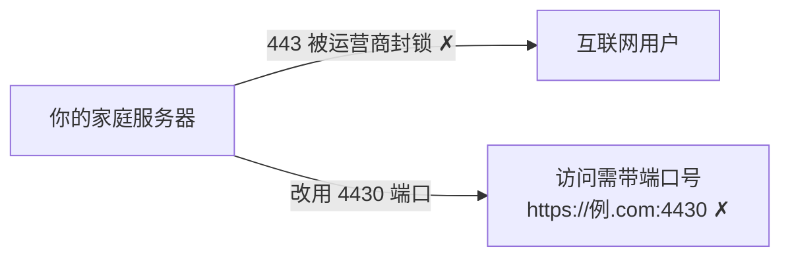
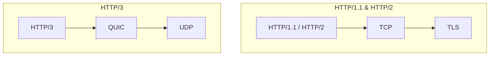
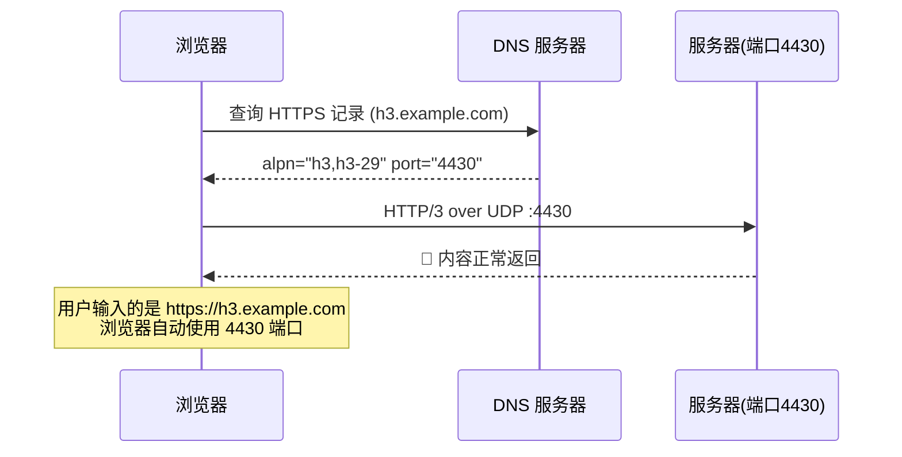
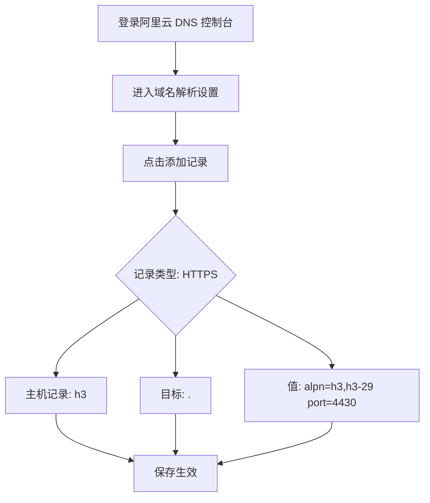

# 用 HTTP/3 实现无端口号访问

> 众所周知，家庭宽带默认封禁80和443端口，导致个人建站都要加上端口号才能访问。但是HTTP3的到来让这个难题有了可解之法。


---

## 1. 问题背景

家庭宽带虽然有时能拿到公网 IP，但运营商对 80 和 443 端口管控极严——你根本无法在这两个标准端口上对外提供服务。



直接后果：

- ❌ 无法用标准 HTTPS 端口对外提供 Web 服务
- ❌ 非标准端口虽能用，但 URL 必须带丑陋的端口号：`https://example.com:4430`
- ❌ 个人博客、静态网站、API 服务部署体验极差

> 好消息：**HTTP/3**（RFC 9114，2022 年正式标准化）基于 QUIC/UDP 传输，端口不再是硬编码的 443，结合 **DNS HTTPS 记录**（RFC 9460/9461）即可实现端口的"隐形"配置。

---

## 2. HTTP/3 与 QUIC 核心概念

HTTP/3 是 HTTP 协议的第三代版本，与 HTTP/1.1 和 HTTP/2 最大的区别在于底层传输协议：



### HTTP/3 四大优势

| 特性 | 说明 |
|------|------|
| **解决队头阻塞** | TCP 要求数据按序传输，一个丢包全队等待；QUIC 多流独立传输，互不影响 |
| **更快连接** | 内置 TLS 1.3，支持 **0-RTT** 握手，首次连接即可发送数据 |
| **动态端口** | 端口不固定，可通过 DNS 或响应头动态发现 |
| **强制安全** | 加密内置，无需额外配置 TLS 层 |

### 浏览器支持情况（截至 2025）

| 浏览器 | 最低版本 | 状态 |
|--------|----------|------|
| Chrome | v87+ | ✅ 默认启用 |
| Firefox | v88+ | ✅ 默认启用 |
| Edge | v87+ | ✅ 默认启用 |
| Safari | 全版本 | ✅ 默认启用 |

> **整体浏览器支持率达 94%**，生产环境已完全可用了。

---

## 3. 原理：如何"隐藏"端口号

核心流程如下：



### 两种端口发现机制

| 机制 | 工作方式 | 优缺点 |
|------|----------|--------|
| **Alt-Svc 头** | 服务器在 HTTP/2 响应中告知 HTTP/3 端口 | 首次连接仍需 HTTP/2，多一次握手 |
| **DNS HTTPS 记录** ✅ | 直接在 DNS 中声明 HTTP/3 端口 | 零额外握手，推荐方案 |

### 辅助技术：DoH（DNS over HTTPS）

加密 DNS 查询，防止运营商劫持或干扰 DNS 解析结果，推荐配合使用。

---

## 4. 准备工作

确保你已拥有

 - 公网 IP
 - 域名

---

## 5. 服务器侧 Nginx 配置 

### Nginx 配置示例

```nginx
http {
    # 开启 HTTP/3 协议
    server {
        # HTTP/3 监听 UDP 4430 端口
        listen 4430 quic;
        # HTTP/2 回退监听 TCP 4430 端口（兼容不支持 HTTP/3 的客户端）
        listen 4430 ssl;

        server_name h3.example.com;

        ssl_certificate     /etc/letsencrypt/live/example.com/fullchain.pem;
        ssl_certificate_key /etc/letsencrypt/live/example.com/privkey.pem;

        # 允许的 HTTP/3 ALPN
        ssl_protocols TLSv1.3;
        ssl_early_data on;

        # 关键：告知浏览器支持 HTTP/3
        add_header Alt-Svc 'h3=":4430"; ma=86400';

        location / {
            root   /var/www/html;
            index  index.html;
        }
    }
}
```

### 关键配置项详解

| 指令 | 作用 |
|------|------|
| `listen 4430 quic` | 启用 HTTP/3 over QUIC（UDP） |
| `listen 4430 ssl` | 回退到 HTTP/2 over TLS（TCP） |
| `ssl_protocols TLSv1.3` | HTTP/3 强制要求 TLS 1.3 |
| `Alt-Svc` | 通知客户端服务器也支持 HTTP/3 |
| `ssl_early_data on` | 开启 0-RTT，减少握手延迟 |

### 验证配置

```bash
# 检查配置是否正确
nginx -t

# 重启 Nginx
nginx -s reload
```

> 服务启动后，先通过 `https://h3.example.com:4430` 验证能否正常访问。

---

## 6. 云侧配置 DNS HTTPS 记录

这是**整个方案最核心的一步**——通过 DNS 告诉浏览器使用 HTTP/3 和自定义端口。

### 以阿里云 DNS 为例



**详细参数说明：**

| 字段 | 值 | 说明 |
|------|-----|------|
| 记录类型 | `HTTPS` | SVCB/HTTPS 记录，非传统记录类型 |
| 主机记录 | `h3` | 子域名，最终为 `h3.example.com` |
| 目标 | `.` | `.`表示自身域名 |
| **值** | `alpn="h3" port="4430"` | **声明 HTTP/3 协议和指定端口** |

### 验证 DNS 记录

```bash
dig HTTPS h3.example.com

; <<>> 应答示例 <<>>
; 预期能看到 alpn="h3" port="4430"
```

> ⚠️ HTTPS 记录与 CNAME 记录冲突，如有 CNAME 需先删除。

---

## 7. 客户端配置与验证

### 主流浏览器

 - Firefox - 已**默认支持 HTTP/3 和 DNS HTTPS 记录**，直接访问 `https://h3.example.com` 即可。
 - Chrome - 默认支持，但是似乎不是很友好

### 验证

HTTP/3支持情况验证：<https://quic.nginx.org>

## 8. 方案对比：各显神通

| 方案 | 优点 | 缺点 | 推荐场景 |
|------|------|------|----------|
| **✅ HTTP/3 + DNS HTTPS** | 无端口号、原生支持、零中转 | 需公网 IP、配置门槛中等 | **本文推荐方案** |
| ✅ Cloudflare Tunnel | 无需公网 IP、自动 HTTPS | 流量经过 CF、延迟增加 | 无公网 IP 用户 |
| ✅ FRP + Nginx 反代 | 速度快、可自控 | 需 VPS 中转、配置复杂 | 追求性能与可控性 |
| ❌ 非标准 TCP 端口 | 最简单 | URL 必须带端口号 | 临时测试 |

---

## 9. 结语

通过 HTTP/3 + DNS HTTPS 记录，我们成功实现了：

- ✅ **无端口号**：浏览器自动发现 UDP 4430 端口
- ✅ **标准 HTTPS**：完整 TLS 加密，不受运营商 443 封锁影响
- ✅ **链路直达**：无需 CDN 或隧道中转，延迟最低

这套方案特别适合**有公网 IP 的家庭宽带用户**搭建个人博客、NAS 反向代理或小型 API 服务。随着 HTTP/3 浏览器覆盖率已达 94%+，现在是时候拥抱这项技术了。
