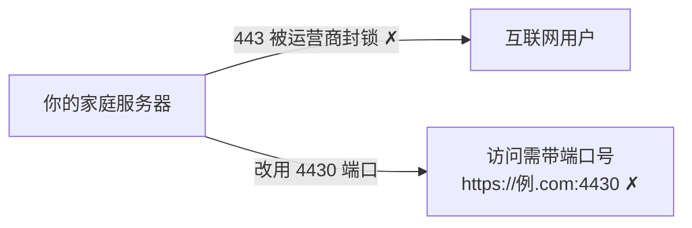
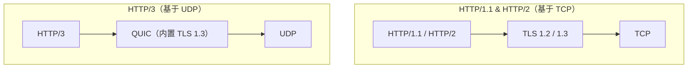
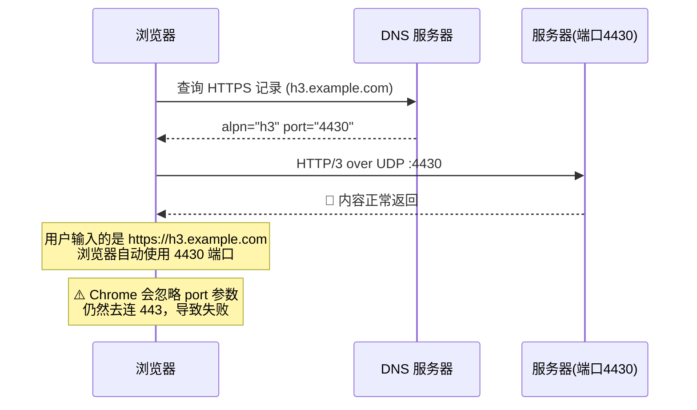
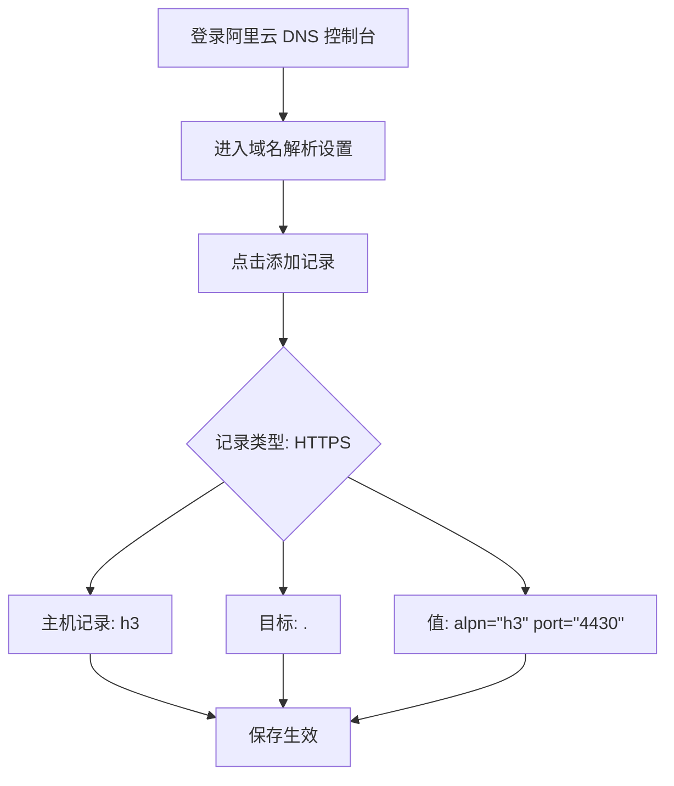

---
title: "用 HTTP3 突破家庭宽带80/443端口封禁"
date: 2026-06-09
description: ""
tags: ["web"]
categories: ["${folder}"]
---

# 用 HTTP/3 实现无端口号访问

> 国内多数家庭宽带默认封禁 80 和 443 端口，个人建站只能带上端口号才能访问。HTTP/3 配合 DNS HTTPS 记录，提供了一条绕开该限制、实现"无端口号访问"的路——**但它在浏览器端的支持面远比想象中窄，本文会把边界一并讲清楚。**

---

## ⚠️ 先说结论

这套方案的成立，**完全依赖浏览器是否实现 DNS HTTPS 记录里的 `port` 参数**——这和"浏览器支持 HTTP/3"是**两件完全不同的事**：

| 浏览器 | 支持 HTTPS 记录的 `port` 参数？ | 本方案 |
|---|---|---|
| **Firefox** | ✅ 是（源码实现） | ✅ 可用，但**必须开 DoH**，且首次访问需刷新一次 |
| **Chrome / Edge / Android WebView** | ❌ **否** | ❌ 不可用 |
| Safari | ⚠️ 无一手证据 | 不建议依赖 |

原因见第 6 节：RFC 9460 把 `port` 定义为 **automatically mandatory** 参数——**不实现它的客户端必须忽略整条记录**。Chromium 至今没有实现（bug 40867585，2022-09 立，仍未修复），所以 Chrome 会直接无视你那条记录，老老实实去连 443。

> **如果你需要覆盖 Chrome 用户，请直接看第 8 节的 Cloudflare Tunnel / 前置 443 反代方案。**

---

## 1. 问题背景

国内多数家庭宽带即使拿到公网 IP，运营商对 80 和 443 端口管控也极严——你无法在这两个标准端口上对外提供服务。



直接后果：

- ❌ 无法用标准 HTTPS 端口对外提供 Web 服务
- ❌ 非标准端口虽能用，但 URL 必须带丑陋的端口号：`https://example.com:4430`
- ❌ 个人博客、静态网站、API 服务部署体验极差

> **先澄清一个常见误解**：HTTP/3 的默认端口**仍然是 443**。URL 里不写端口时，浏览器就是走 443，不存在任何"自动端口发现"。所谓"端口可以隐藏"，靠的是额外机制（Alt-Svc 响应头 / DNS HTTPS 记录）把浏览器**引到另一个端口**上。本文讲的正是后者。

好消息是，这套机制确实存在：

- **HTTP/3** —— RFC 9114，2022 年正式标准化
- **QUIC** —— RFC 9000；**TLS over QUIC** —— RFC 9001
- **DNS HTTPS 记录（SVCB）** —— RFC 9460

---

## 2. HTTP/3 与 QUIC 核心概念

HTTP/3 与 HTTP/1.1、HTTP/2 最大的区别在于底层传输协议——**注意 TLS 所在的位置**：



### HTTP/3 四大优势

| 特性 | 说明 |
|------|------|
| **解决队头阻塞** | TCP 要求数据按序传输，一个丢包全队等待；QUIC 多流独立传输，互不影响 |
| **握手更快** | TLS 1.3 内建于 QUIC，握手与传输层合并。**恢复会话**时可用 0-RTT 提前发送数据——注意：0-RTT 只适用于会话恢复，**首次连接不可能 0-RTT**，且它存在重放风险，服务端需自行决定是否接受 |
| **端口可协商** | 协议本身不绑定端口号，可通过 Alt-Svc 响应头或 DNS HTTPS 记录告知客户端实际端口（**URL 不含端口时默认仍是 443**） |
| **强制加密** | QUIC 强制使用 TLS 1.3，不存在明文降级（但**证书仍然必须有效**，浏览器不会为 QUIC 破例跳过证书校验） |

### 浏览器支持情况

这里必须区分两个维度——**支持 HTTP/3** 和 **支持 HTTPS 记录的 `port` 参数**，后者才是本方案的关键：

| 浏览器 | HTTP/3 默认启用 | 支持 `port` 参数 | 备注 |
|--------|----------------|-----------------|------|
| Chrome / Edge | v87+ | ❌ **不支持** | bug 40867585 至今未修 |
| Firefox | v88+ | ✅ 支持 | 需开启 DoH |
| Opera（桌面） | v74+ | ❌ 不支持 | 与 Chromium 同源 |
| Safari / iOS Safari | **16+** 默认启用 | ⚠️ 无一手证据 | 需 macOS 11+；14/15 仅实验性且默认关闭，全量到 2024-09 |
| Samsung Internet | ❌ 不支持 | ❌ 不支持 | |
| Opera Mini | ❌ 不支持 | ❌ 不支持 | |

> 很多资料会写"HTTP/3 浏览器支持率已达 94%"——那是 **HTTP/3 的覆盖率**，**不是本方案的可用率**。本方案的实际可用率约等于 Firefox 的浏览器份额。

---

## 3. 原理：如何"隐藏"端口号

理想流程如下。**注意：这一流程目前只有 Firefox 实测成立**，Chrome 会在拿到记录之后仍然忽略 `port`：



### 两种端口发现机制

| 机制 | 工作方式 | 优缺点 |
|------|----------|--------|
| **Alt-Svc 头** | 服务器在 HTTP/2 响应中告知 HTTP/3 端口 | 首次连接仍需 HTTP/2，多一次握手；且**必须能先连通原端口** |
| **DNS HTTPS 记录** ✅ | 直接在 DNS 中声明 HTTP/3 端口 | 无需首次 HTTP/2 握手（Firefox）；但依赖客户端实现 `port` 参数 |

### 辅助技术：DoH（DNS over HTTPS）

加密 DNS 查询，防止运营商劫持或干扰解析结果。

**对本方案来说，DoH 基本是必需品**——根源在于 HTTPS 记录是 DNS **type 65**，而传统解析链路根本传递不了它：

| 取记录的通道 | 能否拿到 type 65 |
|---|---|
| 操作系统通用接口（`getaddrinfo`） | ❌ 只能返回 A / AAAA |
| Firefox 自带 DNS 客户端（即 TRR / DoH） | ✅ 任意记录类型 |
| Firefox 的 native 路径（直接问系统） | ⚠️ 存在，但多数情况下不可用，见下 |

Firefox 确实实现了"直接问系统"的 native 路径（Win11+ 走 `DnsQuery_A`、Linux 走 `res_query`、Android API ≥ 29），但它靠不住：

- **Windows 10 上被明确禁用**——源码注释写明 `DnsQuery_A` 在 Win10 上会**返回成功却不返回任何记录**，所以 pref `network.dns.native_https_query_win10` 默认为 `false`
- **macOS 上默认关闭**（`network.dns.native_https_query` 在 macOS 默认 `false`）
- 即使在 Win11+ / Linux 上"启用"，它**仍然依赖你那套本地 DNS 能不能真正回答 type 65**。而 Windows 自带的 `nslookup` 连这个查询类型都表达不了（报 `unknown query type: HTTPS`），`Resolve-DnsName` 的类型枚举里也没有 HTTPS
- 国内还多一层：路由器上的 dnsmasq / 代理软件（fake-ip）也可能不转发或改写 type 65

> **实测**：一台 Windows Server 2025（build 26100，按 Firefox 的 `build >= 22000` 规则本该走 native 路径）关闭 DoH 连续访问 3 次，**全部失败**；开启 DoH 后稳定成功。**所以别赌 native 路径，直接开 DoH。**

---

## 4. 准备工作

确保你已拥有：

- **公网 IP**，且运营商允许你要用的那个**非标准端口入站**——**TCP 与 UDP 都要**
- **域名**，且 DNS 服务商支持添加 **HTTPS 记录**（阿里云、腾讯云、Cloudflare 等均支持）
- **覆盖目标子域的有效证书**。QUIC 同样校验证书，浏览器不会为 HTTP/3 跳过证书错误
- **整条链路放通 UDP**：NAT / 防火墙 / 云安全组 / **以及隧道**（若用 FRP 中转，必须同时配置 `type='udp'` 的代理，只配 TCP 的话 HTTP/3 一定失败）

> 如果你没有公网 IP，或运营商封禁了**全部**入站端口，本文方案不适用——请直接看第 8 节的隧道 / CDN 方案。

---

## 5. 服务器侧 Nginx 配置

### Nginx 配置示例

```nginx
http {
    server {
        # HTTP/3：监听 UDP 4430
        listen 4430 quic reuseport;
        # TCP 4430：给不支持 HTTP/3 的客户端回退
        listen 4430 ssl;

        server_name h3.example.com;

        # 证书必须覆盖 h3.example.com（SAN），否则 HTTP/3 一样会被拒绝
        ssl_certificate     /etc/letsencrypt/live/h3.example.com/fullchain.pem;
        ssl_certificate_key /etc/letsencrypt/live/h3.example.com/privkey.pem;

        # QUIC 强制 TLS 1.3；但 TCP 回退口没必要砍掉 1.2，否则老客户端连不上
        ssl_protocols TLSv1.2 TLSv1.3;

        # 显式开启 HTTP/2 —— 该指令默认是 off，
        # 只写 listen ... ssl 得到的是 HTTP/1.1，不会协商 h2
        http2 on;

        # HTTP/3（1.25.0+ 起该指令默认即为 on，写上更直观）
        http3 on;

        # 0-RTT：需要 nginx >= 1.29.1 且 OpenSSL >= 3.5.1。
        # 在 1.29.1 之前用 OpenSSL 构建时，无论这里怎么写都无法开启 0-RTT。
        # ssl_early_data on;

        # 告知浏览器同一端口上还提供 HTTP/3（首次走 TCP 的客户端靠它升级）
        add_header Alt-Svc 'h3=":4430"; ma=86400';

        location / {
            root  /var/www/html;
            index index.html;
        }
    }
}
```

### 关键配置项详解

| 指令 | 作用 |
|------|------|
| `listen 4430 quic reuseport` | 启用 HTTP/3 over QUIC（UDP）。要求 nginx 编译时带 `--with-http_v3_module` |
| `listen 4430 ssl` | TCP 回退监听。**本身只提供 HTTP/1.1**，要 HTTP/2 必须再加 `http2 on;` |
| `ssl_protocols TLSv1.2 TLSv1.3` | QUIC 强制 1.3，但 TCP 回退口保留 1.2 更稳妥 |
| `http2 on` | 开启 HTTP/2（该指令默认 `off`） |
| `http3 on` | 开启 HTTP/3 协商（默认即为 `on`） |
| `Alt-Svc` | 通知客户端同一端口也支持 HTTP/3 |
| `ssl_early_data on` | 0-RTT，减少握手延迟。**有版本门槛，见上方注释** |

### 验证配置

```bash
nginx -t          # 检查语法
nginx -s reload   # 重载
```

> 服务启动后，先通过 `https://h3.example.com:4430` 验证能否正常访问。
> 这一步不只是验证——**它会预热客户端的替代服务 / 记录缓存**，正好绕开后面要说的"首次访问失败"问题。

---

## 6. 云侧配置 DNS HTTPS 记录

这是**整个方案最核心的一步**——通过 DNS 告诉浏览器使用 HTTP/3 和自定义端口。

> ⚠️ **关键前提**：RFC 9460 把 `port` 定义为 **automatically mandatory** 参数——**不实现该参数的客户端必须忽略整条记录**。截至 2026 年，只有 Firefox 实现了它，Chrome / Edge 会直接无视这条记录。**这是本方案最大的限制，请先确认你的用户群体。**

### 以阿里云 DNS 为例



**详细参数说明：**

| 字段 | 值 | 说明 |
|------|-----|------|
| 记录类型 | `HTTPS` | SVCB/HTTPS 记录，非传统记录类型 |
| 主机记录 | `h3` | 子域名，最终为 `h3.example.com` |
| 目标 | `.` | `.` 表示自身域名 |
| **值** | `alpn="h3" port="4430"` | **声明 HTTP/3 协议与指定端口** |

> `h3-29` 是 QUIC draft-29 的**已废弃** ALPN，现代浏览器只认 `h3`，不需要再写。
>
> 另外 RFC 9460 规定 `alpn` 的**默认集是 `{h3, http/1.1}`**——所以只写 `alpn="h3"` 时，非 QUIC 客户端仍可用 HTTP/1.1 走同一端口。如果你希望它们也走 h2，可显式写 `alpn="h3,h2,http/1.1"`。

### 验证 DNS 记录

```bash
dig HTTPS h3.example.com

# 或用 DoH 直接查
curl -s "https://dns.alidns.com/resolve?name=h3.example.com&type=HTTPS"
```

预期能看到 `alpn="h3" port="4430"`。

### 冲突提示

- ⚠️ HTTPS 记录与 **CNAME**、**NS** 记录冲突（同主机记录、同解析线路时），需要先处理
- ✅ HTTPS 记录与 **A / AAAA** 记录**不冲突**，而且必须共存（A/AAAA 给 IP，HTTPS 给端口与 ALPN）

---

## 7. 客户端配置与验证

### Firefox —— 唯一可用

源码层面 Firefox 确实实现了 `port` 参数（`netwerk/protocol/http/nsHttpConnectionInfo.cpp` 的 `CloneAndAdoptHTTPSSVCRecord()` 会把它作为 `mRoutedPort` 应用到真实请求路径上）。使用条件：

1. **开启 DoH（必须）**
   设置 → 隐私与安全 → 拉到底部「启用基于 HTTPS 的 DNS」→ **选「增加的保护」或「最大保护」**（对应 `network.trr.mode` = 2 / 3）→ 提供商选 **阿里云 DNS**，或选「自定义」填 `https://dns.alidns.com/dns-query`

   > ⚠️ **不要选「默认保护」**（`network.trr.mode` = 0）。该模式下 Firefox 会运行一套自动探测 heuristics，其中包含 **canary 域名** `use-application-dns.net`：只要这个域名在你的网络里返回 NXDOMAIN（或本地地址），Firefox 就会**静默把 DoH 关掉**，本方案随之失效，而且没有任何提示。
   > 只要你**显式选择了「增加的保护」/「最大保护」，或者手填了自定义 DoH 地址**，heuristics（含 canary）就会整体停用，不存在这个坑。

2. `network.dns.upgrade_with_https_rr` 与 `network.dns.use_https_rr_as_altsvc` —— **默认已是 `true`，无需修改**
3. 直接访问 `https://h3.example.com`

#### DoH 提供商可选值

**不是必须用阿里云**——任何能返回 type 65 的解析器都可以。下表几家实测 `type 65` 查询均正常返回：

| DoH 提供商 | 端点（填进 Firefox 的「自定义」框） | 能返回 type 65 | 备注 |
|---|---|---|---|
| 阿里云 | `https://dns.alidns.com/dns-query` | ✅ | 国内可直连、延迟低，**推荐** |
| 腾讯 DNSPod | `https://doh.pub/dns-query` | ✅ | 国内可直连 |
| Google | `https://dns.google/dns-query` | ✅ | 国内连通性视网络而定 |
| Cloudflare | `https://cloudflare-dns.com/dns-query` | ✅ | 国内连通性视网络而定 |
| Quad9 | `https://dns.quad9.net/dns-query` | ✅ | 只接受 HTTP/2 请求（RFC 8484 §5.2） |

> 之所以推荐阿里云：国内可直连、延迟低，而且它本来就是本站域名的权威 DNS，省心而已。

> ⚠️ **首次访问可能失败或弹出证书错误，刷新一次即可。**
> 原因是冷缓存时 Firefox 会先去尝试默认的 443；等 HTTPS 记录进入缓存后，后续访问就会直奔你配置的端口走 QUIC。**这不是配置错误**，是这套机制的固有行为。

### Chrome / Edge / Android WebView —— 不可用

Chromium 明确不支持。源码 `net/dns/dns_response_result_extractor.cc` 中直接丢弃端口不一致的记录：

```cpp
// Ignore services at a different port from the request port.
// Chrome does not yet support endpoints diverging by port.
if (service->port().has_value() &&
    service->port().value() != request_port) {
  continue;
}
```

而且真正进入连接逻辑的 `net/base/connection_endpoint_metadata.h` **连 port 字段都没有**。对应 bug 自 2022 年 9 月挂到现在仍是 `New`：[issues.chromium.org/issues/40867585](https://issues.chromium.org/issues/40867585)。

**不是"不友好"，是根本不支持。** 没必要在这条路上反复试。

### 验证是否真的走了 HTTP/3

```bash
# 1) 浏览器 DevTools
#    Network 面板 → 右键表头 → 勾选 Protocol 列，看到 h3 才算成功

# 2) 页面内 JS（返回 "h3" 才算数）
#    performance.getEntriesByType("navigation")[0].nextHopProtocol

# 3) curl —— 需要编译了 ngtcp2 的版本（Ubuntu 自带 curl 没有）
curl --http3 -I https://h3.example.com/

# 4) 服务端本机验证 QUIC 监听是否真的起来了
openssl s_client -quic -connect 127.0.0.1:4430 -alpn h3
```

在线验证：<https://cloudflare-quic.com/>

---

## 8. 方案对比：各显神通

| 方案 | 无端口号 | Chrome 可用 | 优点 | 缺点 | 推荐场景 |
|------|---------|------------|------|------|----------|
| **HTTP/3 + DNS HTTPS** | ✅ | ❌ 仅 Firefox | 无端口号、零中转、延迟最低 | 依赖浏览器实现、需公网 IP 且非标准端口可入站 | Firefox 用户 / 自用 |
| **Cloudflare Tunnel** | ✅ | ✅ | 无需公网 IP、自动 HTTPS、自带 HTTP/3 | 流量经过 CF、国内延迟较高 | 无公网 IP 或需覆盖全浏览器 |
| **前置 443 反代 / SNI 分流** | ✅ | ✅ | 复用已有 443，全浏览器可用 | 需要有可支配 443 的入口 | 有 VPS 且能改 443 |
| **FRP + Nginx 反代** | ❌（带端口） | ✅ | 速度快、完全自控、可承载 UDP 与 HTTP/3 | 需 VPS 中转、配置较复杂 | 已有 VPS，追求可控性 |
| **非标准 TCP 端口** | ❌ | ✅ | 最简单 | URL 必须带端口号 | 临时测试 |

---

## 9. 结语

通过 HTTP/3 + DNS HTTPS 记录，我们实现了：

- ✅ **无端口号**：浏览器自动发现并连接你配置的端口（**当前仅 Firefox 成立**）
- ✅ **完整 TLS 加密**：不受运营商 443 封锁影响
- ✅ **链路直达**：无需 CDN 或隧道中转，延迟最低（前提是运营商允许该非标准端口入站）

这套方案特别适合**有公网 IP 的家庭宽带用户**自用，或面向 Firefox 用户提供服务。

但请务必记住它的边界：**HTTP/3 的浏览器覆盖率 ≠ 本方案的可用率**。要覆盖 Chrome（也就是绝大多数用户），仍然需要一个真正监听 443 的入口——要么把服务挪到 443，要么在 443 前面挂一层按 SNI 分发的反代，要么用 Cloudflare Tunnel 这类把 443 放在边缘的方案。
