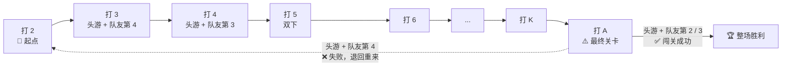

# 🃏 掼蛋规则玩法

## 一、游戏基本玩法

### 1.1 基本设定

| 项目 | 说明 |
| :--- | :--- |
| **👥 人数** | 4人（你与对面的队友对战左右两家对手） |
| **🃏 牌数** | 两副牌共108张，**每人27张** |
| **💡 核心玩法** | 类似"跑得快"+"升级"，**跑第一（头游）的队伍才能升级** |
| **🏆 最终目标** | 从"2"开始打，哪队先成功闯过"A"关，哪队获胜 |

### 1.2 升级路线图（从2打到A）

双方各有一条赛道，每局只有**头游方**能前进，输方原地踏步。谁先闯过 A 关谁获胜。

> 📌 图中标的是从起点 2 一口气跳到对应级别需要的条件。每局赢了就按跳级规则往前推，一直冲到 A 关为止。
>
> 两队各有自己的赛道，互不影响。比如我方打 5、对方可能还在打 3——谁先过 A 谁赢。

### 1.3 升级与跳级规则

只有拿到**头游（第1名）**的队伍才能升级。看队友跑第几名决定跳几级：

| 你们队的名次 | 名称 | **升级数** | 举例（从打5开始） |
| :--- | :--- | :--- | :--- |
| 🥇**你第1** + 🥈**队友第2** | **双下（完美！）** | **升3级** ✨✨✨ | 打 **8** (5→6→7→8) |
| 🥇**你第1** + 🥉**队友第3** | 普通赢 | **升2级** ✨✨ | 打 **7** (5→6→7) |
| 🥇**你第1** + 🏅**队友第4** | 险赢 | **升1级** ✨ | 打 **6** (5→6) |
| 你没有拿到第1 | 输了 | **不升级** | 继续打 **5** |

> 📌 **口诀：队友第2升3级，第3升2级，第4升1级。**
>
> ⚠️ 这里的"双下"指你们队拿下 1+2 名（把对手打下去），和进贡中"被双下"（你们拿 3+4 名）含义相反，详见 1.5 节。

### 1.4 级牌与变牌

这是掼蛋最独特的概念，新手一定要搞清楚。

**打几，几就是级牌。** 比如你们在"打2"，那么所有的2就是级牌。

假设正在打2：

| 牌面 | 身份 | 作用 | 能不能单独出？ |
| :--- | :--- | :--- | :--- |
| **♥️2** | **红心级牌（变牌）** | **万能牌！** 可以当大小王之外的**任何一张牌**用，帮你凑顺子、凑炸弹。 | ❌ 不能！只能当"辅助"配别的牌。 |
| **♠2 ♦2 ♣2** | **普通级牌** | 仅次于大王小王的单牌。 | ✅ 能！它就是一张大单牌，或者凑对子。 |

**"变牌"使用示例：**
你手里有 **♥️2 + 9♠ + 10♠ + J♠ + Q♠** → 把♥️2当成**K♠** → 凑成 **9,10,J,Q,K 同花顺！** 威力巨大！

## 二、进贡与抗贡（下一局开始前）

> 📖 本节依据国家体育总局《竞技掼蛋竞赛规则（试行）》第十条整理。

**核心原则**：规则只认"游数"不认"队友"——**下游必须向上游进贡**，不管是不是一队的。

### 2.1 进贡规则

| 上一局结果 | 双方名次 | 规则 |
| :--- | :--- | :--- |
| 🏆 **你们双下**（对手全灭） | 你 1 + 队友 2；对手 3 + 4 | 对手**双贡**：对手 4 游 → 你，对手 3 游 → 你队友 |
| 🏆 **普通赢** | 你 1 + 队友 3；对手 2 + 4 | 对手**单贡**：对手 4 游 → 你 |
| ⚠️ **险赢** | 队友 1 + 你 4；对手 2 + 3 | 你**内贡**：你（4 游）→ 队友（1 游） |
| 😰 **你们输了（单下）** | 对手 1 + 你 4；队友 3 | 你**单贡**：你（4 游）→ 对手（1 游） |
| 😰 **你们被双下** | 对手 1+2；你们 3+4 | 你们**双贡**：你 → 对手 1 游，队友 → 对手 2 游 |

> ⚠️ 险赢也一样要进贡——4 游给 1 游，哪怕 1 游是你的队友。规则只看名次，不看队伍。

### 2.2 抗贡规则

| 场景 | 规则 |
| :--- | :--- |
| **单贡** | 下游在进贡前抓到 **2 张大王** → 🛡️ 抗贡，不贡不还，头游先出牌 |
| **双贡** | 双下方**任意一人**有 2 张大王 → 🛡️ 全队抗贡，两人都不贡不还，头游先出牌 |

> 💡 不需要两个人都各拿 2 张大王，只要队里有一人摸到，整队免贡。

### 2.3 进贡牌与还牌规则

进贡方给出一张牌后，上游（接收方）**必须还一张回去**，这叫"还牌"。

| 环节 | 规则 |
| :--- | :--- |
| **进贡** | 下游（4 游）把自己手中**最大的一张牌**（红心级牌除外）给上游（1 游） |
| **还牌** | 上游必须还一张**牌点 ≤ 10** 的牌给下游；如果手里全大于 10，还**最小**的那张 |
| **双贡还牌** | 上游（1 游）收牌点大的那张，二游（2 游）收小的，各自对应还牌；牌点相同时按顺时针分配 |

### 2.4 下一局谁先出牌？

| 情况 | 谁先出牌 |
| :--- | :--- |
| **单贡** | 🎯 下游（进贡方）先出 |
| **双贡** | 🎯 两个输家（进贡方） 自行商量谁先出 |
| **抗贡** | 🎯 上游（头游）先出 |

> 💡 **记忆口诀**：进贡 = 进贡方先出；抗贡 = 上游先出。

## 三、牌型大全

掼蛋共有 **10 种可出牌型**，分为"炸弹类"（能压任何牌）和"普通类"（同类型才能互压）。

### 3.1 炸弹类（能压一切普通牌）

> 📌 **炸弹口诀**：张数多就是王道。同张数比牌点，级牌炸弹最大。
>
> **同花顺特殊地位**：能干掉 4 张和 5 张炸弹，但打不过 6 张及以上的炸弹。
>
> 理论上凭变牌最多能凑出 **10 张炸弹**（8 张同点 + 2 张变牌），实战中 4~6 张最常见。

| 排名 | 牌型 | 组成 | 说明 | 示例 |
| :---: | :--- | :--- | :--- | :--- |
| 👑 1 | **四大天王（王炸）** | 🃏🃏 + 🃏🃏（大小王各 2 张） | 最大，定局牌 | 🔴🔴🔵🔵 |
| 💣 2 | **炸弹（8 张）** | 8 张同点数 | 张数越多越大 | — |
| 💣 3 | **炸弹（7 张）** | 7 张同点数 | 同上 | — |
| 💣 4 | **炸弹（6 张）** | 6 张同点数 | 同上 | 6 张 K |
| 💣 5 | **同花顺** | 5 张同花色 + 连续点数 | 压 4 炸和 5 炸 | 7♠8♠9♠10♠J♠ |
| 💣 6 | **炸弹（5 张）** | 5 张同点数 | 同张数比牌点 | 5 张 9 |
| 💣 7 | **炸弹（4 张）** | 4 张同点数 | 最小的炸弹 | 4 张 6 |

### 3.2 普通牌型（同类互压，不能跨类型比）

普通牌型**只能同类型、同长度比较**。别人出顺子，你只能出同样张数的顺子来压。

单张牌点大小顺序：**2 < 3 < 4 < … < 10 < J < Q < K < A < 级牌 < 小王 < 大王**

| 牌型 | 组成要求 | 大小比较 | 示例 |
| :--- | :--- | :--- | :--- |
| **单张** | 任意 1 张牌 | 按牌点顺序 | ♠A |
| **对子** | 2 张同点数（王也可成对） | 按牌点顺序 | 8♠8♦、大王+大王 |
| **三同张** | 3 张同点数 | 按牌点顺序 | K♠K♦K♥ |
| **三带二（夯）** | 3 张同点数 + 1 个对子 | 只比三同张，**不比对子** | KKK + 77 |
| **顺子** | 5 张连续点数（**仅限 5 张**） | 比最大那张 | 34567、10JQKA |
| **连对（木板）** | 3 对连续对子（**仅限 3 对**） | 比最大对子 | 33 44 55 |
| **钢板（三连张）** | 2 组连续三同张（**仅限 2 组**） | 比最大三同张 | 333 444 |

> 📌 **A 的特殊规则**：在顺子/连对/钢板中，A 只能出现在两端——A2345（A=1）或 10JQKA（A=14），不能出现在中间（如 JQKA2 非法）。王不能参与连对和钢板。

### 3.3 变牌如何参与组牌

| 用法 | 说明 | 示例（打 8 时） |
| :--- | :--- | :--- |
| **凑炸弹** | ♥8 + 3 张同点数 = 4 张炸 | ♥8 + 7♠7♦7♥ = 7777 |
| **凑同花顺** | ♥8 充当缺的那张同花色牌 | ♥8 + 9♠10♠J♠Q♠ = 8♠9♠10♠J♠Q♠ |
| **凑顺子** | ♥8 充当缺的连续牌 | ♥8 + 3♠4♠5♠6♠ = 3♠4♠5♠6♠8♠ |
| **凑连对** | ♥8 配单张凑成对子，再凑连对 | ♥8 + 单 7 → 77，再拼 556677 |
| **凑钢板** | ♥8 配对子凑成三同张，再凑钢板 | ♥8 + 44 → 444，再拼 333444 |

> ⚠️ **变牌不能配王**（大小王不算），也不能单独出。

## 四、极速记忆卡

| 我想知道... | 答案一句话 |
| :--- | :--- |
| **怎么升级？** | 跑第1就行，看队友名次：2→3级，3→2级，4→1级。 |
| **级牌是啥？** | 打几，几最大（仅次于王），比如打8，所有8都很大。 |
| **变牌是啥？** | 红心级牌是万能牌，能变任何牌（除了王），但不能单独出！ |
| **怎么赢？** | 从2出发，一路升级到A，并且打A时必须"头游+队友不是最后"才算过关。 |
| **进贡给啥牌？** | 给最大的牌（王优先，但红心级牌不给）。 |
