# 欢迎来到区块链的世界~！！！

> 本文以 Bitcoin 为参考原型，系统梳理区块链的核心原理，辅以 Mermaid 流程图、对比表格与个人理解注释，力求直观易懂。

---


## 一、区块与区块链结构

### 1.1 什么是区块？

区块是区块链网络中**打包、存储交易数据**的基本单元，类比账本中的一页。每个区块由 **区块头 (Block Header)** 与 **区块体 (Block Body)** 两部分组成。

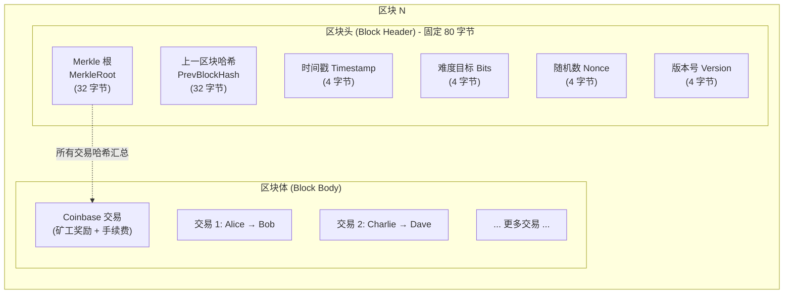

| 字段 | 大小 | 作用 |
|------|------|------|
| **PrevBlockHash** | 32 字节 | 指向前一区块的哈希，形成链式结构 |
| **MerkleRoot** | 32 字节 | 所有交易的 Merkle 根哈希，快速校验交易完整性 |
| **Timestamp** | 4 字节 | 区块生成时间戳 |
| **Bits** | 4 字节 | 当前挖矿难度目标值 |
| **Nonce** | 4 字节 | 随机数，矿工不断尝试以找到合法哈希 |
| **Version** | 4 字节 | 区块版本号，用于软分叉升级 |

> 区块头这 80 字节是整个区块链安全模型的精华——通过哈希指针串联历史、通过 Merkle 根锚定交易、通过难度和 Nonce 实现 PoW 竞争。好比一个快递包裹，区块头是面单（记录来源、去向、编号），区块体是实际货物。

### 1.2 区块链的链式结构

区块链由无数区块**按时间顺序单向串联**形成：

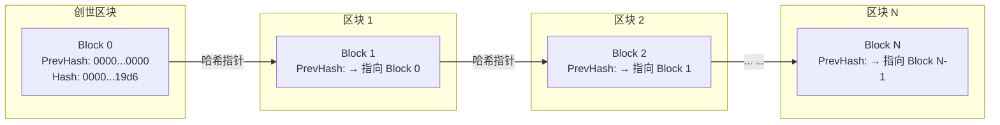

**不可篡改的原理**：每个区块的哈希由区块头所有字段 + Nonce 共同计算得出。若篡改 Block N 中任意数据 → 其哈希值改变 → Block N+1 的 PrevHash 不匹配 → 整条链断裂。

---

### 1.3 哈希函数的雪崩效应——为什么改 1 比特也不行？

哈希函数（SHA-256）有一个关键特性叫 **雪崩效应 (Avalanche Effect)**：

```
输入: "Block 100: Alice pays Bob 1 BTC"
SHA256: a1b2c3d4e5f6...（64位十六进制）

输入: "Block 100: Alice pays Bob 2 BTC"  （只改了 1 → 2）
SHA256: f7e8d9c0a1b2...（完全不同的输出！）

两个哈希值没有任何可预测的关系
```

**这对区块链意味着什么？**

```
假设攻击者修改了第 100 个区块中的一笔交易：

原始 Block 100 哈希: 0000abc...def
篡改后 Block 100 哈希: 7f3e...921a  ← 完全变了

Block 101 的区块头中存储的 PrevHash 仍然是: 0000abc...def
但现在 Block 100 的实际哈希是: 7f3e...921a

结果: 7f3e...921a ≠ 0000abc...def
     → 链接断裂！
     → Block 101 及其后续所有区块全部失效

要修复这条链，攻击者必须：
  1. 重新挖 Block 100（找到新的 Nonce 使哈希 < 目标值）
  2. 重新挖 Block 101
  3. 重新挖 Block 102
  4. ... 一直挖到当前最新区块
  
  同时全网正常矿工也在不断延长正确链
  → 攻击者必须比全网其他矿工加起来还快 → 需要 >50% 算力
```

---

### 1.4 区块链在磁盘上到底长什么样？

你可能会想：Block 0 → Block 1 → Block 2 → ... 这个链表是直接存在一个文件里的吗？

不是。Bitcoin 用 **LevelDB**（一种键值数据库）存储数据，数据库里有以下几个"桶"：

| 存储桶 | 键 | 值 | 用途 |
|--------|-----|------|------|
| `blocks/` | 区块哈希 | 完整原始区块数据 | 按哈希查找区块 |
| `blocks/index/` | 区块高度 | 区块哈希 + 文件位置 | 按高度快速定位区块 |
| `chainstate/` | UTXO 的 txid + 输出序号 | UTXO 的面额 + 锁定脚本 | 验证新交易时快速查 UTXO 是否未花 |
| `peers/` | 对等节点 IP | 连接状态、最后通信时间 | P2P 网络管理 |

**关键洞察**：当你转账时，全节点不是去"读区块链找历史"——它直接查 `chainstate/` 这个 UTXO 数据库，确认你的 UTXO 还在不在。这比遍历区块链快了无数倍。`chainstate/` 是区块链的"快照索引"，每次新区块确认后同步更新。

---

### 1.5 创世区块——一切开始的地方

2009 年 1 月 3 日，中本聪挖出了 Block 0（创世区块），并在 Coinbase 交易里嵌入了一行字：

```
The Times 03/Jan/2009 Chancellor on brink of second bailout for banks
```

这是当天《泰晤士报》的头版标题。这行字至少有两层含义：
1. **时间证明**：证明创世区块不可能早于 2009-01-03 被创建（报纸还没出呢）
2. **政治宣言**：讽刺传统银行体系反复需要政府救助，暗示去中心化货币的必要性

创世区块有个特殊之处——它的 PrevHash 是 `0000000000000000000000000000000000000000000000000000000000000000`（全是 0）。它没有"上一个区块"，所以挖它用的 Nonce 也是中本聪直接指定的，而非通过 PoW 竞争得出。

**有趣的是**：创世区块中的 50 BTC 奖励是**永远无法花掉的**——因为它不在 UTXO 集中（中本聪写代码时故意没有把它加入可花费输出）。这也算是一种"献给区块链的祭品"。

---

### 1.6 区块传播——新区块如何在网络中扩散？

当一个矿工挖到合法区块后，如何让全球所有节点尽快收到？

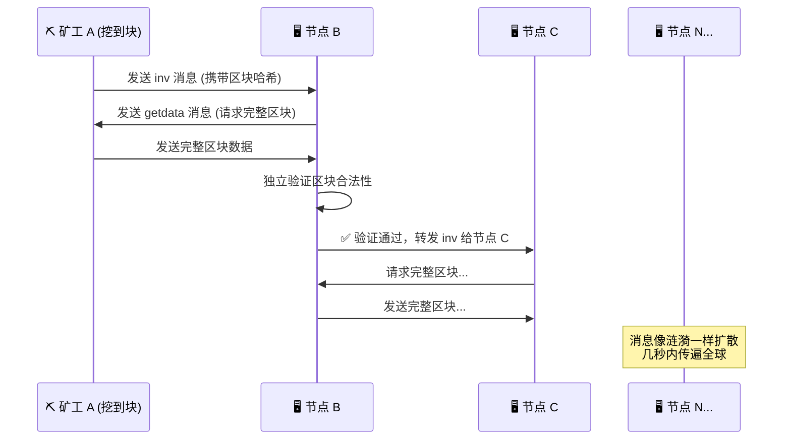

但有一个问题：一个 1MB 的区块在网络中层层转发，浪费了大量带宽——邻居节点之间可能 90% 的交易数据都已经在内存池里了，不需要再传一遍。

**解决方案：紧凑区块 (Compact Blocks, BIP 152)**

```
传统方式: 矿工 → 转发完整 1MB 区块给所有邻居
            ↓ 邻居转发给他们的邻居
            ↓ 带宽消耗巨大，传播慢

紧凑区块: 矿工 → 只发送 区块头 + 交易 ID 短列表（~10KB）
            ↓ 接收方: "这些交易ID我内存池里都有，自己拼回来"
            ↓ 带宽减少 99%，传播加速 10 倍以上

只有接收方内存池里没有的交易，才会单独请求完整数据
```

> **关键补充**：区块数量理论上无上限。以比特币为例，**有限的是代币发行总量（2100 万枚）**，而非区块数量。只要网络存在交易需求，区块就会不断产生——这保证了区块链作为"永久数据存储层"的可行性。

---

## 二、默克尔树与 SPV 验证

### 2.1 默克尔树 (Merkle Tree)

默克尔树是一种**二叉树结构**，叶子节点是每笔交易的哈希值，逐层两两拼接再哈希，最终汇聚成唯一的 **Merkle Root**。

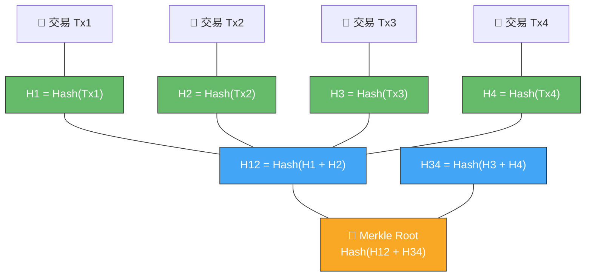

### 2.2 SPV 轻量验证——用 3 条哈希证明一笔交易

**SPV (Simplified Payment Verification)** 允许轻节点无需下载完整区块链即可验证一笔交易是否存在。

下面我们一步步拆解 Merkle 证明的工作过程。假设区块里有 4 笔交易（Tx1-Tx4），你要证明 Tx3 在区块中：

```
步骤 1: 你要什么数据？
  → 你已经有 Tx3 的内容（自己钱包里就有）
  → 你需要从全节点获取一个 "Merkle Proof"（默克尔证明）

步骤 2: 全节点给你什么？
  全节点只需要给你 3 条哈希（而不是全部 4 笔交易）：
    - H4 = Hash(Tx4)           ← 和 Tx3 同一层的兄弟节点
    - H12 = Hash(H1, H2)       ← 上层的兄弟节点
    - 以及 Merkle Root 本身    ← 顶端校验值

步骤 3: 你如何自己验证？
  Step A: 计算 H3 = Hash(Tx3)        ← 你自己算（你的钱包里有 Tx3）
  Step B: 计算 H34 = Hash(H3 + H4)   ← 用 H3 和全节点给的 H4
  Step C: 计算 Root' = Hash(H12 + H34) ← 用 H34 和全节点给的 H12
  Step D: 比对 Root' == Merkle Root？
          ✅ 相等 → Tx3 确定在区块中
          ❌ 不等 → 全节点在骗你
```

**逐步可视化**：

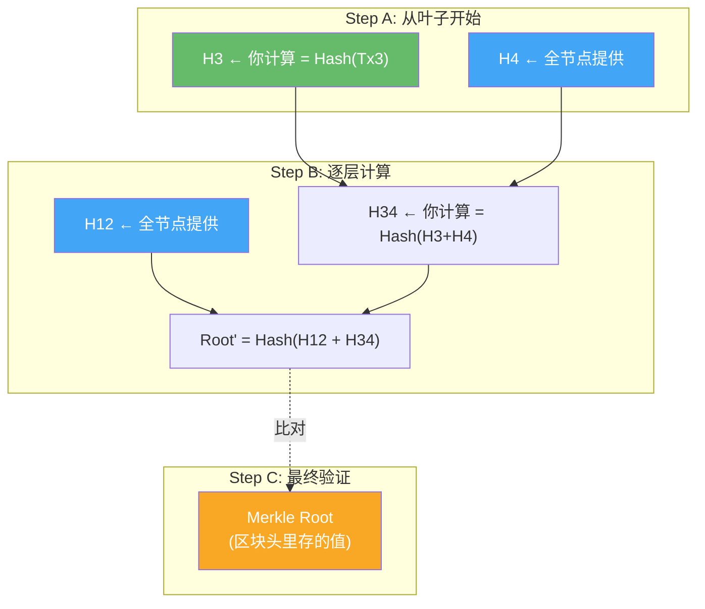

**为什么只需要 O(log n) 条哈希？**

```
区块里有 n 笔交易
Merkle 树的高度 = log2(n)
证明路径上每层只需要 1 个兄弟节点的哈希

示例:
  1024 笔交易 → 树高 10 → 只需 10 条哈希即可证明任意一笔
  65536 笔交易 → 树高 16 → 只需 16 条哈希
  
  而你不需要下载另外 65535 笔交易！
```

---

### 2.3 奇数叶子和重复叶子——边界情况怎么处理？

Merkle 树是二叉的，但交易数量不一定是 2 的幂次：

```
场景: 区块中有 5 笔交易

排列:
  Tx1  Tx2    Tx3  Tx4    Tx5  ???
  
处理方式: 如果某层有奇数个节点 → 复制最后一个节点
  Tx1  Tx2    Tx3  Tx4    Tx5  Tx5  ← Tx5 被复制来配对

  H1   H2     H3   H4     H5   H5'
    H12          H34          H55
        H1234          H5555
               Root
```

---

### 2.4 Merkle 证明的安全性边界

> Merkle 证明能证明"交易在区块里"，但它**不能**证明任何事情超出这一点。一个常见的误区是：有人以为 SPV 验证了交易就万事大吉了。实际上 SPV 节点仍然信任全节点提供了正确的**最长链区块头**。如果一个全节点故意给轻节点一个"孤块"的区块头（不是最长链），轻节点看到 Merkle 证明通过就相信了，但实际上这个区块可能已经被主链抛弃了。
>
> 因此，轻节点的安全模型是：**信任多数算力不会合谋欺骗它**。对于日常支付（小额、快速确认），这种信任是足够的。但对于大额交易，还是应该运行全节点独立验证全部历史。

---

## 三、共识机制

### 3.1 共识问题的本质——拜占庭将军问题

在讲共识算法之前，必须先理解它要解决什么问题。

**拜占庭将军问题 (Byzantine Generals Problem)** 是分布式系统中的一个经典难题：

```
场景:
  几个将军各自率领军队，包围了一座城市。
  他们只能通过信使互相通信。
  必须协调一致：要么一起进攻，要么一起撤退。
  如果有的进攻有的撤退 → 全军覆没。

但问题在于:
  - 信使可能被敌人截获（消息丢失）
  - 信使可能叛变（传递假消息）
  - 将军中可能有叛徒（故意发错误指令）

问题: 忠诚的将军们如何在这种情况下达成一致？
```

**区块链的解决方案 —— PoW**：

```
传统思路: 将军们互相发消息投票 → 需要交换大量信息 → 容易被叛徒扰乱

中本聪的思路: ⚡ "别投票了，比赛解题吧！"
  
  规则:
  1. 所有将军同时解一道极其困难的数学题
  2. 谁先解出来，谁的作战计划就被采纳
  3. 解出来的将军把答案广播给所有人
  4. 其他将军验证答案正确后，执行该计划
  5. 继续解下一道题

  为什么叛徒无法捣乱？
  - 叛徒可以发假消息，但假消息没有正确答案 → 被拒绝
  - 叛徒想抢到出题权 → 必须真的解题 → 需要投入真实算力
  - 只要忠诚将军的总算力 > 50%，叛徒就永远追不上
```

---

### 3.2 工作量证明 (PoW)

PoW 是 Bitcoin 使用的共识算法，核心逻辑：**用算力投票，最长链胜出**。

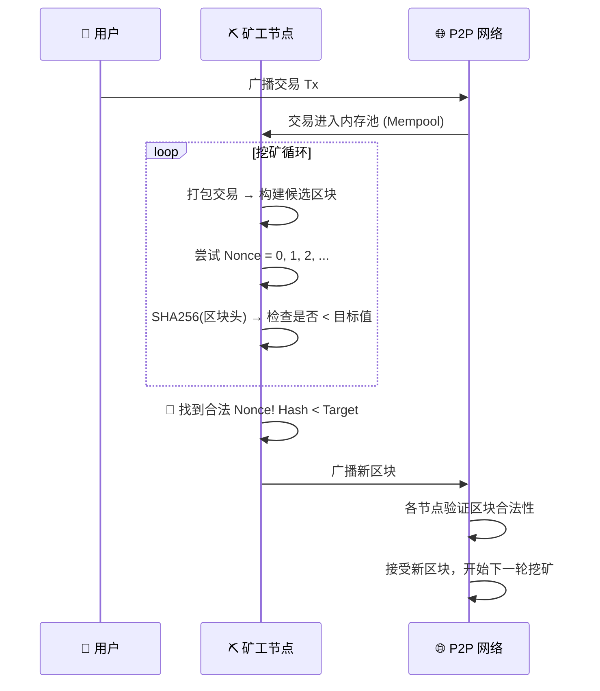

**公式表达**：

```
SHA256(SHA256(Version + PrevHash + MerkleRoot + Timestamp + Bits + Nonce)) < Target
```

- Nonce 取值范围：0 ~ 2^32（约 43 亿），现代矿机数秒内即可遍历完
- 穷举完后可修改 Coinbase 交易的 ExtraNonce 字段，或调整交易组合，重置 Nonce 空间继续尝试

---

### 3.3 权益证明 (PoS)——不拼算力，拼资产

PoW 最大的争议是耗电。PoS 换了一种思路：**谁持有的币越多、持有时间越长，谁越有动力维护网络**。

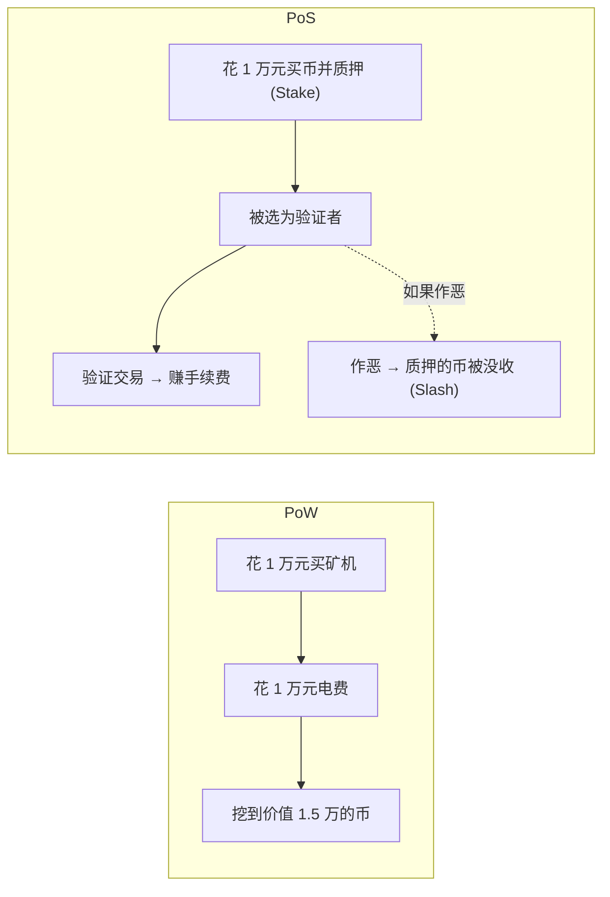

**Ethereum PoS 的关键机制**：

| 机制 | 说明 |
|------|------|
| **质押 (Staking)** | 锁定 32 ETH 成为验证者 |
| **随机选择** | 每 12 秒随机选一个验证者提议新区块 |
| **委员会投票** | 随机选数百个验证者组成委员会，投票确认区块 |
| **罚没 (Slashing)** | 验证者作恶（双重签名、离线过久）→ 没收部分或全部质押金 |
| **退出队列** | 想取回质押金需排队，防止恶意验证者快速跑路 |

**PoS 的博弈逻辑**：

```
你质押了 32 ETH（假设价值 10 万美元）。
如果你诚实验证 → 每年获得 ~3-5% 的质押收益。
如果你作恶 → 系统没收你的 32 ETH。

作恶收益必须 > 32 ETH 才划算。
但如果作恶攻击成功，ETH 价格大概率暴跌，
你的非法所得也会贬值。

结论: 在理性经济人假设下，诚实比作恶更有利可图。
```

---

### 3.4 DPoS——用选票代替算力

DPoS（委托权益证明）进一步简化：持币者**投票选出少数"超级节点"**，由这些节点轮流记账。

```
EOS 的模式:
  → 全网投票选出 21 个超级节点
  → 每 0.5 秒一个节点生产一个区块
  → 21 个节点轮完一圈 = 一轮

优势:
  ✅ TPS 极高（数千笔/秒）
  ✅ 确认极快（秒级）

代价:
  ❌ 只有 21 个出块节点 → 比 PoW 中心化
  ❌ 节点可能串通（"卡特尔"风险）
  ❌ 持币大户的投票权重远高于散户
```

---

### 3.5 PBFT——联盟链的实用方案

PBFT（实用拜占庭容错）用在**已知参与者身份**的联盟链中，不需要挖矿：

```
三阶段协议:

Phase 1 - Pre-Prepare (预准备):
  主节点: "我提议下一个区块是 [Block Data]"

Phase 2 - Prepare (准备):
  各节点收到后互相广播: "我同意主节点的提议"
  需要收集至少 2/3 节点的同意

Phase 3 - Commit (提交):
  各节点再次确认: "我已看到超过 2/3 的人同意"
  达到 2/3 后 → 区块最终确认

安全性保证: 只要不超过 1/3 的节点是恶意的，系统就能正常运作。
但要求: 节点总数不超过几十个（消息复杂度 O(n²)），不适合公链。
```

---

### 3.6 最终性 (Finality) 对比——"完成"的定义不同

| 共识算法 | 最终性类型 | 解释 |
|----------|-----------|------|
| **PoW (Bitcoin)** | 概率最终性 | 交易永远可能被逆转，但概率随确认数指数下降。6 个确认后逆转概率 ≈ 可忽略 |
| **PoS (Ethereum)** | 经济最终性 | 2 个 epoch（约 13 分钟）后，逆转需要至少 1/3 验证者被罚没（经济损失极大） |
| **PBFT** | 绝对最终性 | 一旦 2/3 节点同意，交易永久不可逆转 |
| **DPoS** | 委托绝对最终性 | 2/3 超级节点确认后不可逆转（但超级节点本身可能串通） |

> 共识机制的选择本质上是**安全模型三选二**的权衡。PoW 用物理成本换安全，代价是慢和耗能。PoS 用经济博弈换安全，代价是"有钱人说了算"。DPoS 和 PBFT 用中心化换速度，代价是信任少数人。没有一个方案能同时做到"去中心化、安全、快速"——这就是区块链的**不可能三角 (Trilemma)**。

---

## 四、区块链网络与节点分类

### 4.1 网络拓扑

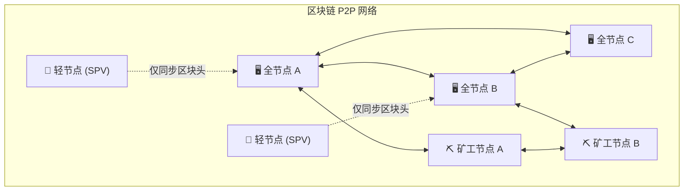

### 4.2 节点类型对比

| 维度 | 🖥️ 全节点 | ⛏️ 矿工节点 | 📱 轻节点 (SPV) |
|------|-----------|-------------|-----------------|
| **存储** | 完整区块链 (~600GB+) | 完整区块链 | 仅区块头 (~60MB) |
| **硬件要求** | 普通 PC 即可 | 专业 ASIC 矿机 | 手机即可 |
| **记账权** | ❌ 无 | ✅ 有 | ❌ 无 |
| **交易验证** | 完整独立验证 | 完整独立验证 | 依赖全节点的 Merkle 证明 |
| **收益来源** | 无直接收益 | 区块奖励 + 手续费 | 无 |
| **核心价值** | 网络监督者、数据备份 | 网络安全提供者 | 用户入口、支付便捷 |

### 4.3 节点发现与连接

P2P 网络通过 **DNS Seed** 和 **硬编码种子节点** 完成初始发现：

```
新节点启动 → 连接 DNS Seed → 获取活跃节点 IP 列表
           → 随机连接 8 个对等节点 (outbound)
           → 最多接受 117 个入站连接 (inbound)
           → 通过 addr 消息持续发现更多节点
```

**为什么限制出入站连接数？**

```
出站 8 个 + 入站 117 个 = 最多 125 个连接

出站限制为 8 是因为：
  → 更多连接不会显著提高安全性（8 个不同方向的连接已足够防止日蚀攻击）
  → 但会增加带宽消耗

入站限制为 117 是因为：
  → 维持网络拓扑的多样性
  → 防止单个节点被恶意大量连接耗尽资源
```

---

### 4.4 八卦协议 (Gossip Protocol)——信息如何在 P2P 网络中扩散

区块链网络没有中心服务器来广播消息。所有信息通过 **Gossip 协议** 传播：

```mermaid
sequenceDiagram
    participant A as 🖥️ 节点 A<br/>(收到新交易)

    Note over A: 节点 A 收到一笔新交易

    A->>B: 1. 转发交易给邻居 B
    A->>C: 2. 转发交易给邻居 C
    A->>D: 3. 转发交易给邻居 D

    B->>E: B 再转发给它的邻居 E
    B->>F: B 再转发给它的邻居 F
    C->>G: C 再转发给它的邻居 G

    Note over E,F,G: 像病毒一样扩散<br/>几秒内传遍全网

    Note over F: 每个节点都有 "已见过交易" 的记录<br/>看到重复的 → 不再转发
```

**Gossip 协议的关键规则**：

```
1. 随机选择传播对象
   每个节点不向所有邻居转发，而是随机选几个
   → 避免消息风暴，减少冗余

2. 防重复传播
   每个节点维护一个 "已见过消息" 的哈希集合
   收到已见过的消息 → 忽略，不再转发
   → 防止无限循环

3. 防 DoS 攻击
   节点对每个邻居限制消息速率
   超速的邻居会被暂时断开
```

---

### 4.5 内存池 (Mempool)——交易的"候车室"

每笔交易在被矿工打包进区块之前，先进入**内存池 (Mempool)**：

```
交易生命周期:
  用户广播交易
    → 各节点独立验证（签名、余额、格式...）
    → 验证通过 → 加入内存池
    → 矿工从内存池中选择交易打包
    → 交易被打包进区块并确认
    → 从内存池中删除（因为它不再是"待处理"）

内存池的规则:
  - 每个节点独立维护自己的内存池
  - 没有全局统一的内存池（不同节点看到的内存池可能不同）
  - 默认最大 300MB（Bitcoin Core 默认值）
  - 超过限制 → 丢弃手续费最低的交易
```

**矿工如何从内存池挑选交易？**

```
内存池里有 5000 笔待处理交易，区块只能装 ~3000 笔。

矿工的挑选策略:
  1. 按 手续费/字节 (sat/vB) 降序排列
  2. 优先选 "最肥" 的交易（手续费高、体积小）
  3. Coinbase 交易必须排在第一位（矿工给自己发奖励）
  
  本质: 这是一个背包问题 (Knapsack Problem)
        矿工要在有限的 1MB(或4MB)空间内
        选择最大化总手续费的交易组合
```

> **全节点是区块链的"陪审团"**——虽然没有直接经济激励，但它们独立验证每一笔交易和每一个区块，构成了网络的免疫系统。矿工负责"生产"，全节点负责"质检"。没有全节点的链是盲目的；没有矿工的链是停滞的。

---

## 五、节点故障与容错机制

### 5.1 故障场景分析

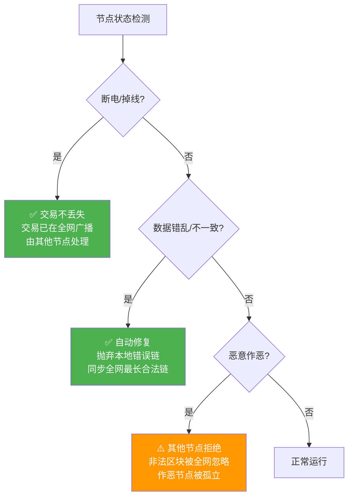

### 5.2 最长链原则 (Longest Chain Rule)

```
场景: 网络中出现两条分叉链

  链 A (主链)    链 B (分叉)
  [0]→[1]→[2]→[3]→[4]→[5]    ← 最长，全网认可
  [0]→[1]→[2]→[3]              ← 较短，自动丢弃
```

- 节点永远选择**累计工作量最大**（通常是区块数最多）的合法链
- 分叉链上的交易不是丢失，而是回到内存池等待重新打包
- 这就是为什么 Bitcoin 交易通常需要 **6 个确认**才算最终不可逆

### 5.3 拜占庭容错 (Byzantine Fault Tolerance)

| 故障类型 | 传统分布式系统 | 区块链 (PoW) |
|----------|---------------|--------------|
| 节点宕机 | 需要冗余设计 | 天然容忍，其他节点继续工作 |
| 节点作恶 | 需要 BFT 算法 | 最长链 + 算力成本天然遏制 |
| 网络分区 | 可能出现脑裂 | 分区恢复后自动收敛到最长链 |
| 大量节点故障 | 系统可能瘫痪 | 只要存在一个完整合法链即可恢复 |

---

### 5.4 51% 攻击到底能做什么——以及不能做什么

很多人听说过"51% 攻击"，但对其能力的理解往往不准确。精确地说：

**51% 攻击者能做什么：**

```
✅ 可以: 逆转自己最近的交易（双花）

  攻击者:
  1. 在正常链上: 用 100 BTC 买某交易所的 USDT，提走
  2. 同时在一条秘密分叉链上: 从区块 N 开始自己挖矿
  3. 秘密链中不包含那笔 100 BTC 的交易
  4. 等 USDT 到手后，公开秘密链（如果它比主链长）
  5. 全网切换到秘密链 → 那笔 100 BTC 交易"从未发生"
  6. 攻击者保留 BTC，又拿到了 USDT
  7. 成本: 维持 >50% 算力 1 小时约需数百万美元（对 BTC）

✅ 可以: 阻止交易确认（审查）

  攻击者持续挖空块（不包含任何交易）
  或故意不打包特定地址的交易
  但用户可以选择多付手续费来"贿赂"其他矿工打包

✅ 可以: 独占区块奖励

  攻击者拒绝在别的矿工挖出的块上继续挖
  只在自己的块上延伸 → 理论上可以抢走所有区块奖励
  但这种情况非常明显，社区会立即发现并反击
```

**51% 攻击者不能做什么：**

```
❌ 不能: 偷别人的币
  没有私钥就无法签名 → 无法创建"Alice 转给攻击者"的合法交易

❌ 不能: 修改历史交易
  篡改 Block 100 → 必须重挖 Block 100 到最新块的所有区块
  这个工作量相当于从那个高度开始和全网竞争
  对 Bitcoin 来说，篡改 1 年前的交易实际不可能

❌ 不能: 改变共识规则（如增发）
  全节点会拒绝违反规则的区块
  攻击者可以挖一个给自己发 100 万 BTC 的区块
  但所有其他节点看到后会说: "这个区块非法，我拒绝"
  攻击者只在自己的分叉链上有 100 万 BTC（别人不认）

❌ 不能: 凭空增发超过区块奖励的上限
  每年新发行量是代码写死的，任何试图修改的区块都会被拒绝

❌ 不能: 偷走矿工费
  即便控制 >51% 算力，每个区块的 Coinbase 奖励仍然有上限
  超出上限的区块会被全网拒绝
```

**现实中的 51% 攻击成本**：

```
攻击 Bitcoin:
  全网算力 ≈ 600 EH/s
  1 EH/s ASIC 矿机 ≈ 5000 万美元
  需要 51% = 300 EH/s → 硬件成本 ≈ 150 亿美元
  还不算电费、场地、冷却...
  → 有这钱不如直接做多 BTC

攻击较小的 PoW 链 (如 ETC):
  全网算力 ≈ 200 TH/s
  可以从 NiceHash 租用算力
  → 每小时的攻击成本仅数千美元
  → ETC 历史上确实遭受过多次 51% 攻击
```

---

### 5.5 为什么确认数越多越安全——概率计算

```
假设攻击者拥有全网 q% 的算力（q < 0.5）
诚实矿工拥有 p% = 1 - q

攻击者在落后 z 个区块的情况下追上的概率:

  P(追上) = (q/p)^z     (当 q < p 时)

  示例:
    攻击者算力 = 10% (q=0.1), 诚实算力 = 90% (p=0.9)
    
    落后 1 块: P = (0.1/0.9)^1 ≈ 11.1%
    落后 2 块: P = (0.1/0.9)^2 ≈ 1.23%
    落后 3 块: P = (0.1/0.9)^3 ≈ 0.14%
    落后 6 块: P = (0.1/0.9)^6 ≈ 0.00019%    ← 约两百万分之一

  即使攻击者有 30% 算力:
    落后 6 块: P = (0.3/0.7)^6 ≈ 0.59%       ← 仍然很低

  攻击者 40% 算力:
    落后 6 块: P = (0.4/0.6)^6 ≈ 8.8%        ← 开始危险
    这就是为什么 >40% 的算力集中就会引发社区警惕
```

> **关键结论**：6 个确认不是魔法数字，而是一个工程上的权衡——对于大多数场景（攻击者算力 < 30%），6 确认提供的安全性已经足够了。如果是数亿美元的大额转账，交易所通常会要求更多确认（如 20-60 个）。

---

## 六、交易模型：UTXO vs 账户模型

### 6.1 先忘掉"余额"，想想你口袋里的现金

这是理解 Bitcoin 最关键的一步。你钱包里显示"3 BTC"，你的直觉反应是：某个数据库里有一行记录 `Alice: 3 BTC`。**大错特错。**

Bitcoin 根本没有"余额"这个概念。它只有**一堆还没花掉的收据**——UTXO。

---

**生活类比：你口袋里有一把现金**

| 现实世界 | Bitcoin UTXO |
|----------|--------------|
| 你有一张 100 元钞票 | 你有一个面额 2 BTC 的 UTXO（来自上个月别人转给你的） |
| 你还有一张 20 元钞票 | 你有一个面额 1 BTC 的 UTXO（来自上周的某笔交易） |
| 你口袋里总共有 100 + 20 = 120 元 | 你钱包里总共有 2 + 1 = 3 BTC |
| 你想买一个 105 元的东西 | 你想转 2.5 BTC 给 Bob |

在现实世界你会怎么做？

```
1. 掏出 100 元钞票 → 交给收银员
2. 掏出 20 元钞票  → 也交给收银员
3. 收银员收下 120 元，找给你 15 元零钱
```

Bitcoin 做的事情**完全一样**：

```
1. 拿出 UTXO-A (2 BTC) → 作为交易的"输入"
2. 拿出 UTXO-B (1 BTC) → 作为交易的"输入"
3. 输出1: 2.5 BTC → Bob 的地址（"付款"）
4. 输出2: 0.5 BTC → Alice 自己新地址（"找零"）
5. UTXO-A 和 UTXO-B 在花掉之后 → 永久销毁
```

**关键规则**：一张钞票不能撕一半用——UTXO 也不能部分花费。你要么全部花掉并找零，要么不花。就像你不能把 20 元钞票撕半张给收银员，你必须整张给出去然后等人找零。

---

### 6.2 一笔 UTXO 交易的完整生命周期

下面我们从头到尾跟踪一笔 Bitcoin 交易：

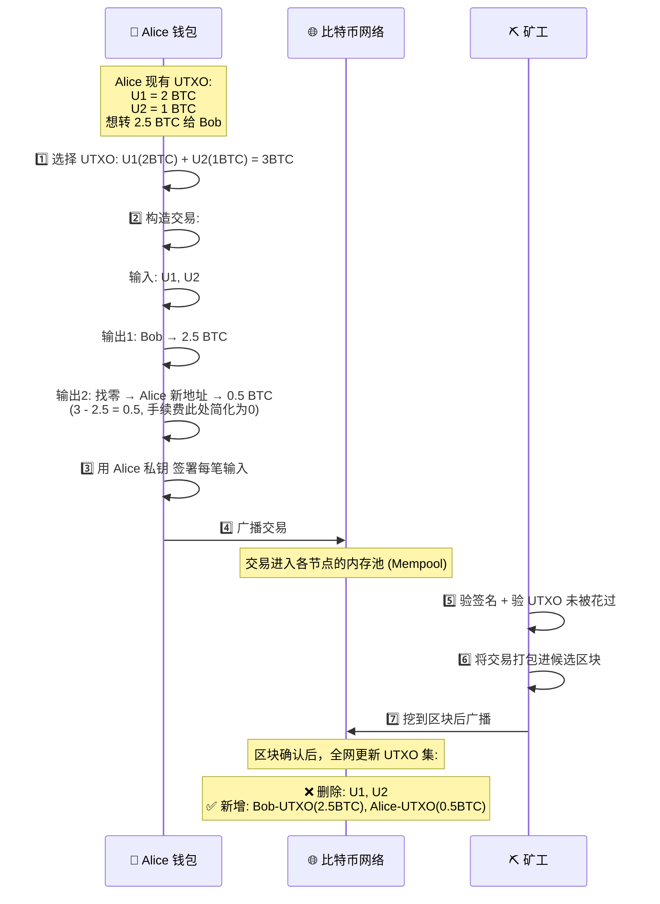

这一步一步发生了什么：

1. **选择 UTXO**：钱包扫描你所有的未花费输出，挑选面额合适的来凑金额。这叫做 **Coin Selection**（硬币选择），是钱包的核心算法之一。
2. **输入必须 ≥ 输出**：输入总额必须 ≥ 输出总额。差额 = 矿工手续费。
3. **签名解锁**：每笔 UTXO 被一个"锁定脚本"控制（约定"只有 Alice 的私钥签名才能花"），Alice 用私钥生成签名来解锁。
4. **UTXO 的生死**：一笔 UTXO 被引用为输入后，就**永久销毁**，变成「已花费输出」。交易结束后，只有新的输出存活在 UTXO 集合中。

---

### 6.3 UTXO 选择的策略：钱包怎么挑硬币？

钱包不是简单地选最大的 UTXO，它会根据策略优化：

| 策略 | 做法 | 效果 |
|------|------|------|
| **FIFO（先进先出）** | 先收到的 UTXO 先花 | 简单公平 |
| **Largest First（最大面额优先）** | 优先选面额最大的 UTXO | 减少输入数量，降低交易体积和手续费 |
| **Smallest First（最小面额优先）** | 优先选小面额 UTXO | 消耗粉尘 UTXO，保持钱包整洁 |
| **Branch and Bound（分支定界）** | 精确计算，找刚好凑够的组合 | 避免产生找零 UTXO，省后续手续费 |

**为什么"避免找零"很重要？**

```
场景：Alice 的 UTXO = [6 BTC], 想转 1 BTC 给 Bob

方案 A (不优化):
  输入: 6 BTC UTXO
  输出1: Bob → 1 BTC
  输出2: 找零 → Alice → 5 BTC  ← 多了一个 UTXO，下次转账要多一笔输入

方案 B (理想):
  输入: 如果有面额恰好 = 1 BTC 的 UTXO
  输出: Bob → 1 BTC  ← 无找零，干净

找零 UTXO 越多 → 未来交易输入越多 → 交易体积越大 → 手续费越高
```

---

### 6.4 粉尘攻击与粉尘 UTXO

**粉尘 (Dust)**：面额极小的 UTXO，小到「花费它需要的手续费 > 它本身的价值」。

```
假设当前网络费率下，一个标准输入+输出的最低手续费 = 0.0001 BTC
你有一个 UTXO 面额 = 0.00005 BTC

结论: 这个 UTXO 被"冻住"了——花费它要倒贴钱，不花它占着钱包空间。
```

2015-2016 年曾有攻击者故意向大量地址发送 1 聪（0.00000001 BTC）的粉尘交易，目的不是获益，而是**膨胀 UTXO 集、拖慢全节点**。Bitcoin Core 后来引入了粉尘输出限制来防御此类攻击。

---

### 6.5 账户模型 (Ethereum)：回归你熟悉的"银行余额"

Ethereum 抛弃了 UTXO，改回你直觉中的样子——**每个地址就是一个银行账户，记录着一个数字余额**。

```
Alice的账户:
{
    balance: 3 ETH,     ← 一个数字余额
    nonce: 15           ← 已发送的交易数量计数器
}

Alice 转 2.5 ETH 给 Bob:
{
    from: Alice,
    to: Bob,
    value: 2.5 ETH,
    nonce: 15           ← 第 15 笔交易
}

执行:
  Alice.balance = 3 - 2.5 = 0.5 ETH
  Bob.balance = Bob.balance + 2.5 ETH
```

**Nonce 机制——账户模型防止双花的武器**：

```
Alice 的第 15 笔交易 (nonce=15) 被打包后:
  → nonce 15 已用，Alice 的新交易必须用 nonce=16
  → 如果 Alice 再广播一笔 nonce=15 的交易，节点直接拒绝
  → 双花被阻断在源头

但如果 Alice 同时广播两笔 nonce=15 的交易:
  → 矿工只会打包先看到的那一笔
  → 另一笔因为 nonce 已被占用而失效
```

---

### 6.6 同一笔转账，两种模型下的视角

我们用一个具体例子对比：

> **Alice 要付 2.5 BTC 给 Bob，她目前有 3 BTC**

| 步骤 | UTXO 模型 (Bitcoin) | 账户模型 (Ethereum) |
|------|---------------------|---------------------|
| **Alice 的状态** | U1=2BTC, U2=1BTC（两个UTXO） | balance=3（一个数字） |
| **构造交易** | 引用 U1+U2 为输入，指定 Bob 和找零输出 | from=Alice, to=Bob, value=2.5 |
| **Alice 新状态** | 新 UTXO = 0.5 BTC（找零地址） | balance = 0.5 |
| **Bob 新状态** | 新 UTXO = 2.5 BTC | balance = 原余额 + 2.5 |
| **旧数据** | U1, U2 永久销毁 | 不保留旧余额记录 |
| **验证方式** | 查 UTXO 集确认输入未被花过 + 验签名 | 验 nonce 顺序 + 余额 ≥ 转账额 + 验签名 |

---

### 6.7 UTXO 模型被低估的深层优势

```
UTXO 的真正价值不在于"像现金"，而在于：

1.  无状态并行验证
    每笔 UTXO 彼此独立。Alice 转 Bob 和 Charlie 转 Dave 可以并行验证，
    互不干扰。账户模型则需要串行验证同一个地址的 nonce 顺序。

2.  天然的可扩展性
    UTXO 集可以分片存储，不同分片处理不同的 UTXO。
    Ethereum 的状态树则是一个全局有向无环图，分片非常困难。

3.  隐私的天然基线
    每次交易都产生新地址（找零地址），UTXO 模型天然鼓励地址复用避免。
    而账户模型下，地址固定就相当于一个公开的银行账号。

4.  轻节点的验证负担极小
    轻节点只需要 Merkle 证明就能验证交易，不需访问全局状态。
```

> UTXO 模型和账户模型代表两种哲学取向。Bitcoin 追求的是**极致的去中心化验证**——任何人用普通电脑就能独立验证全网每一笔交易。为此它牺牲了"用户体验的直观性"（你不能再像看银行余额那样看余额了）。Ethereum 则认为**可编程性 > 极简验证**，所以选择了账户模型来支撑智能合约。这不是谁对谁错，而是目标不同导致的设计取舍。

---

## 七、挖矿机制详解

### 7.1 挖矿的本质

挖矿不是计算一道有意义的数学题，而是一场 **基于算力的概率性哈希竞猜**：

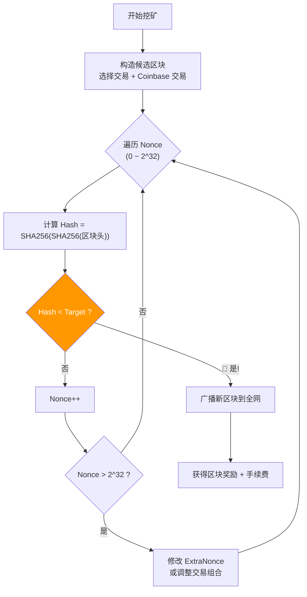

### 7.2 哈希目标值计算

```
Target = 最大目标值 × (当前难度 / 1)

实际计算:
  难度 = 最大目标值 / 当前目标值
  
例如当前难度 ≈ 110 万亿:
  Target ≈ 2^256 / 110万亿
  Hash 开头需要约 76 个前导零 (以二进制计)
```

### 7.3 挖矿概率

```
单次哈希 = 一次抽奖
算力(H/s) = 每秒抽奖次数
出块概率 = 个人算力 / 全网总算力

示例: 
  全网算力 = 600 EH/s = 6 × 10^20 H/s
  个人算力 = 100 TH/s = 1 × 10^14 H/s
  单区块概率 ≈ 1/6,000,000
  预期出块时间 ≈ 6,000,000 × 10 min ≈ 114 年
```

---

### 7.4 矿机的进化——从 CPU 到 ASIC

挖矿硬件的进化史本身就是一部技术军备竞赛：

| 时代 | 硬件 | 算力 | 说明 |
|------|------|------|------|
| 2009-2010 | **CPU** (Intel/AMD) | ~10 MH/s | 中本聪用个人电脑挖出了早期区块 |
| 2010-2011 | **GPU** (ATI/NVIDIA) | ~1 GH/s | 显卡并行计算能力远优于 CPU |
| 2011-2012 | **FPGA** | ~10 GH/s | 可编程芯片，功耗比 GPU 低 |
| 2013-至今 | **ASIC** | ~100 TH/s+ | 专用集成电路，只为 SHA256 而生 |

**ASIC 的残酷真相**：

```
一台最新的 Antminer S21 (2024):
  算力: 200 TH/s
  功耗: 3500W
  价格: ~5000 美元
  
  200 TH/s = 200,000,000,000,000 次哈希/秒
  = 你的 MacBook Pro CPU 算力的 1,000,000 倍

  为什么 ASIC 必须不断更新换代？
    → 新一代矿机效率高 30%，电费省 30%
    → 旧矿机挖矿成本 > 收益 → 关机报废
    → 旧矿机堆成电子垃圾（"矿难"时尤为明显）

  这导致了:
    ✅ 网络哈希率指数级增长 → 安全性越来越强
    ❌ 矿机更新换代快 → 电子垃圾问题
    ❌ 专业矿机厂商垄断（比特大陆占 ~70% 市场份额）
```

---

### 7.5 矿池——个体矿工的生存策略

个人挖矿 = 中彩票，矿池挖矿 = 领工资。

```mermaid
flowchart TB
    subgraph "矿池架构"
        POOL["🏢 矿池服务器<br/>统一分配任务<br/>统一接收收益"]
        M1["⛏️ 矿工1<br/>100 TH/s"]
        M2["⛏️ 矿工2<br/>50 TH/s"]
        M3["⛏️ 矿工3<br/>200 TH/s"]
        M4["⛏️ 矿工..."]
    end

    M1 -->|提交工作量证明 (Share)| POOL
    M2 -->|提交 Share| POOL
    M3 -->|提交 Share| POOL
    M4 -->|提交 Share| POOL

    POOL -->|挖到区块| BLOCK["🪙 区块奖励 + 手续费"]
    BLOCK -->|按 Share 比例分配| M1
    BLOCK -->|按 Share 比例分配| M2
    BLOCK -->|按 Share 比例分配| M3
    BLOCK -->|按 Share 比例分配| M4

    style POOL fill:#f9a825,color:#fff
```

**矿池分配模式对比**：

| 分配方式 | 原理 | 优点 | 缺点 |
|----------|------|------|------|
| **PPS** (按股支付) | 每提交一个 Share 即获固定收益 | 收益稳定，无方差 | 矿池承担运气风险，手续费高 |
| **PPLNS** (按最后 N 股支付) | 只有挖到块时才分配，按最近的 Share 比例 | 矿池风险低 | 收益波动大，矿工可能"白干" |
| **FPPS** (完全 PPS) | PPS 基础上 + 手续费分红 | 稳定 + 额外收益 | 较新，部分矿池不支持 |

**矿池的中心化隐忧**：

```
2024 年 Bitcoin 矿池算力分布 (大约):
  Foundry USA:  ~30%
  AntPool:      ~25%
  F2Pool:       ~15%
  ViaBTC:       ~12%
  Binance Pool: ~5%
  其他:         ~13%

如果前 2 大矿池合谋，理论上有能力发动 51% 攻击。
但现实中矿池只是"协调方"——如果矿池作恶，矿工可以离开。
矿工的经济利益在于保护网络，而非破坏网络。
```

---

### 7.6 矿池通信——Stratum 协议

矿工与矿池之间通过 **Stratum 协议** 通信，它比直接运行 Bitcoin 节点更高效：

```
传统方式 (getwork): 
  矿工 → 节点: "给我一个任务"
  节点 → 矿工: 完整的 1MB 区块数据
  矿工 → 挖 Nonce → 提交结果
  问题: 每次 Nonce 遍历完都要重新请求 → 带宽浪费

Stratum 方式 (现代):
  矿工 连接 矿池服务器 (TCP 长连接)
  矿池 → 矿工: "下一个任务: 区块头 + 目标值" (几百字节)
  矿工 → 挖 Nonce → 提交 Share (仅需证明满足较低难度)
  矿池 → 矿工: "任务更新, 新的区块头" (有新交易来了)
  
  效率: 数据量减少 99.9%
```

> **现实建议**：个人低算力设备理论上存在出块可能，但概率极低。小算力参与者应加入**矿池**，合力挖矿并按算力占比分配收益，获得稳定收入流。选择矿池时注意：① 手续费率 ② 分配模式 ③ 地理位置延迟 ④ 不要给同一矿池 > 30% 的算力。

---

## 八、出块速度与难度调整

### 8.1 难度调整机制

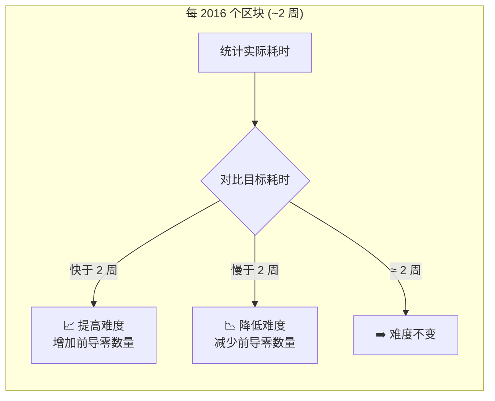

### 8.2 公式

```
新难度 = 旧难度 × (实际 2016 区块耗时 / 目标 20160 分钟)

约束: 单次调整幅度限制在 1/4 ~ 4 倍之间
```

### 8.3 算力与难度的动态平衡

| 算力变化 | 难度响应 | 最终效果 |
|----------|----------|----------|
| 算力翻倍 | 2 周后难度翻倍 | 出块速度回归 10 分钟 |
| 算力减半 | 2 周后难度减半 | 出块速度回归 10 分钟 |
| 算力不变 | 难度不变 | 维持 10 分钟 |

---

### 8.4 为什么是 2016 个区块？

```
设计目标: 每 10 分钟出一个块, 每 2 周调整一次难度

  2016 × 10 分钟 = 20160 分钟 = 14 天 = 2 周

为什么是 2 周？
  → 足够长来平滑短期的算力波动
  → 足够短来快速响应算力变化
  → 2 周是一个行业标准周期

为什么不是实时调整？
  → 实时调整会引入博弈漏洞（矿工可以操纵出块时间戳）
  → 2016 块作为一个"不可伪造的时间窗口"
  → 矿工很难精确控制 2016 个块的出块时间
```

---

### 8.5 时间戳的陷阱——矿工可以作弊吗？

比特币的难度调整依赖每个区块的时间戳。矿工能不能伪造时间戳来作弊，让系统误以为出块很慢、从而降低难度？

```
攻击尝试: 矿工把区块时间戳设得很靠后
  → 下一个难度调整周期看到"哦，这次花了 3 周"→ 降低难度

防御措施:
  1. 区块时间戳必须 > 过去 11 个区块的中位数时间
     → 不能设置得比最近的区块还早
     
  2. 区块时间戳不能 > 网络时间 + 2 小时
     → 不能设置得比真实的"未来"还远
     
  3. 2016 个区块的均值很难操纵
     → 单独几个区块的偏差被大量区块稀释

结论: 矿工可以小幅操纵时间戳（±1小时），但无法大幅影响难度调整。
```

---

### 8.6 以太坊的"难度炸弹"——另一种思路

Ethereum 曾在 PoW 时代引入 **难度炸弹 (Difficulty Bomb)**：

```
目的: 强制社区从 PoW 迁移到 PoS

机制:
  难度炸弹是一个指数增长的额外难度值
  每 10 万个区块 ≈ 炸弹难度翻倍
  
  效果:
  未拆除时: 出块时间越来越慢 → 网络几乎冻结
  拆除后: 恢复到正常出块速度
  
  这就像一个"定时炸弹"，逼迫开发者:
    "要么按时升级到 PoS，要么网络瘫痪"
    
  Ethereum 开发团队多次推迟这个炸弹
  最终在 2022 年 9 月（The Merge）成功过渡到 PoS
```

> **核心洞察**：难度调整是区块链的"恒温器"——无论全球算力是暴增还是暴跌，系统始终将出块速度稳定在 10 分钟。这保证了交易确认时间的可预测性，防止了通胀失控（出块太快）或网络停滞（出块太慢）。

---

## 九、矿工收益与减半经济

### 9.1 收益构成

| 收益来源 | 当前 (2026) | 说明 |
|----------|------------|------|
| **区块奖励** | 3.125 BTC/块 | 每 4 年减半一次 |
| **交易手续费** | 0.0005 ~ 0.001 BTC/笔 | 市场竞价，拥堵时飙升 |

### 9.2 比特币减半时间线

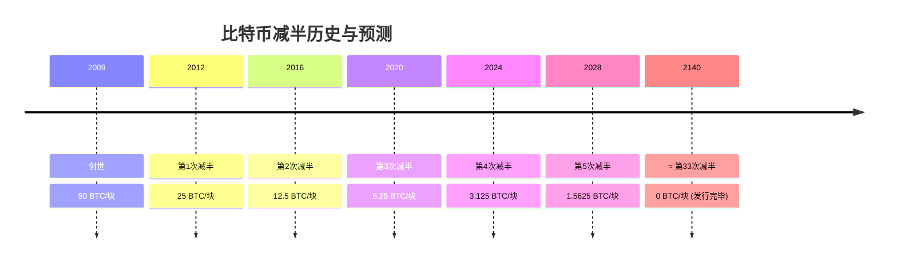

### 9.3 发行完毕后的运行逻辑

```
Bitcoin 总量: 2100 万枚 (预计 2140 年全部挖出)
区块奖励: 0
矿工收益: 100% 依赖交易手续费

网络不会停止的原因:
1. 只要有转账需求 → 用户支付手续费 → 矿工有动力继续挖矿
2. 手续费市场将自然形成均衡价格
3. 可能出现矿工"淘汰"，算力下降 → 难度自动下调 → 新平衡达成
```

---

### 9.4 手续费市场如何运作

交易手续费不是系统规定的，而是**用户竞价、矿工挑选**的自由市场：

```
区块空间是稀缺资源:
  每个区块最多容纳 ~3000 笔交易 (SegWit 后约 1 vMB)
  
  用户想快点被打包 → 愿意付更多手续费
  矿工想多赚钱 → 优先打高手续费的交易

实际操作:
  用户 Alice: 手续费 5 sat/vB  ← 交易体积 250 vB → 总费 1250 sat
  用户 Bob:   手续费 2 sat/vB  ← 交易体积 250 vB → 总费 500 sat
  
  矿工会先打包 Alice 的交易，后打包 Bob 的（如果空间够）
```

**RBF (Replace-By-Fee) —— 加钱加速**：

```
Alice 发了一笔 2 sat/vB 的交易，等了 1 小时还没确认。

RBF 机制允许她:
  1. 广播一笔"替代交易"（相同的输入，更高的手续费，如 10 sat/vB）
  2. 矿工看到替代交易的手续费更高 → 优先打包替代版
  3. 原来的 2 sat/vB 交易被废弃（因为输入已被花掉）

这就像: 你在外卖平台下单后，加了小费让骑手优先送
```

**CPFP (Child-Pays-For-Parent) —— 子交易替父付**：

```
场景: Bob 收到一笔未确认的付款（Alice 转给他的），但想立刻花掉。

Alice的交易 (手续费过低，卡在内存池):
  输入: Alice的UTXO
  输出1: Bob → 1 BTC
  输出2: 找零 → Alice

Bob 可以创建一笔"子交易":
  输入: 那笔未确认的 Alice→Bob 的输出
  输出: Charlie → 0.999 BTC
  手续费: 极高 (0.001 BTC，即 100000 sat)

  矿工看到: "嘿，如果我同时打包这两笔交易，能赚 100000 sat 手续费"
  → 把父交易也一起打包了（即使父交易自身手续费很低）

这就像: 孩子给快递小哥一笔小费，让快递小哥同时送父子两件快递
```

---

### 9.5 内存池手续费热力图——可视化拥堵

在高拥堵时期（如 2017 年牛市、2021 年牛市），内存池里的交易按手续费分层：

```
手续费率 (sat/vB)      待确认交易数量
    100+               █ ~200 笔
    50-99              ███ ~800 笔
    20-49              ███████ ~3000 笔
    5-19               ████████████████ ~15000 笔
    1-4                ████████████████████████████ ~50000 笔

结论: 如果你付 5 sat/vB，要排 15000+ 笔交易后面 → 可能等好几小时
      如果你付 100 sat/vB，前面只有 200 笔 → 下个区块就能确认

实时查看: mempool.space 可以看到全球内存池的实时拥堵情况
```

---

### 9.6 减半的经济逻辑——越来越稀缺

```
2009: 每块 50 BTC → 每年产出 ~262.5 万 BTC
2012: 每块 25 BTC → 每年产出 ~131.25 万 BTC  (减半)
2016: 每块 12.5 BTC → 每年产出 ~65.6 万 BTC   (减半)
2020: 每块 6.25 BTC → 每年产出 ~32.8 万 BTC   (减半)
2024: 每块 3.125 BTC → 每年产出 ~16.4 万 BTC  (减半)

当前的年通胀率 ≈ 1.7% (2024 减半后)
约在 2032 年 → 年通胀率将降至 < 1%
远低于黄金的年开采率 (~1.5%) 和法定货币的通胀率

每次减半后的规律 (历史数据):
  减半前 6-12 个月: 市场开始预期，价格通常上涨
  减半后 12-18 个月: 供给冲击显现，通常触发牛市
  原因: 矿工每日卖出压力减半 → 如果需求不变 → 价格必须上升才能平衡
```

> **补充观点**：2140 年后 Bitcoin 的安全性将完全依赖手续费市场。如果链上交易需求不足，手续费过低，可能导致算力萎缩、51% 攻击成本下降。这也是为什么 Layer2（如闪电网络）和链上高价值结算被寄予厚望——它们确保每笔链上交易都有足够的手续费来维持安全预算。

---

## 十、密码学与信任模型

### 10.1 非对称加密原理

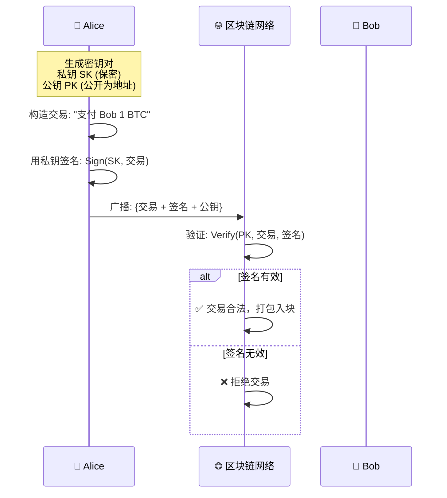

### 10.2 两代哈希函数

| 函数 | 用途 | 安全性 |
|------|------|--------|
| **SHA-256** | 挖矿 PoW、交易哈希、区块哈希 | 抗碰撞、抗原像 |
| **RIPEMD-160** | 将公钥缩短为比特币地址 (再经 Base58Check) | 配合 SHA-256 双重哈希 |
| **SHA-256 + RIPEMD-160** | 生成 P2PKH 地址 | 双重保护 |

地址生成流程：
```
Private Key → ECDSA (secp256k1) → Public Key → SHA-256 → RIPEMD-160 → Base58Check → 地址
```

### 10.3 为什么区块链不需要 CA 证书？

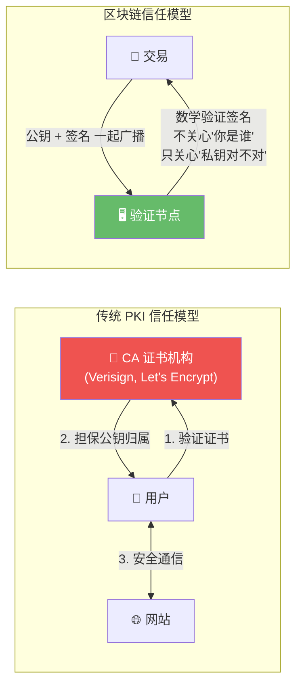

**核心差异**：
- **传统互联网**：需要 CA 证明"这个公钥确实属于 example.com" → 信任第三方
- **区块链**：不验证身份，只验证签名。你是谁不重要，**持有对应私钥就代表你有权支配这笔资产** → 信任数学

---

### 10.4 私钥从哪里来？——熵与随机性

私钥本质上就是一个**256 位的随机数**。这个东西有多随机，决定了你的资产有多安全。

```
私钥生成过程:

1. 操作系统收集熵 (Entropy)
   来源: 鼠标移动轨迹、键盘敲击间隔、磁盘 I/O 时间、网络数据包时间...
   → 组合成一个 128-256 位的随机种子

2. 用这个种子通过椭圆曲线 (secp256k1) 生成公私钥对
   种子 → HMAC-SHA512 → 512 位密钥材料
                      → 前 256 位 = 私钥
                      → 后 256 位 = 链码 (用于HD钱包)

3. 私钥 → 公钥
   k = 私钥 (256位随机数)
   K = k × G  (G是椭圆曲线上的固定基点)
   → 这是一个单向计算: 有k可以算出K, 但无法从K反推k

关键: 256 位的搜索空间有多大？
  2^256 ≈ 10^77 (1后面77个零)
  
  对比: 
    宇宙中的原子总数 ≈ 10^80
    地球上的沙粒数 ≈ 10^19
    
  结论: 遍历所有可能的私钥 > 遍历宇宙中所有原子
       地球上所有计算机算到宇宙热寂也枚举不完
```

---

### 10.5 助记词与 HD 钱包——不用再背一长串字符

早期的比特币钱包让你直接保管私钥（一长串十六进制），极不友好。现代钱包使用 **BIP39 助记词**：

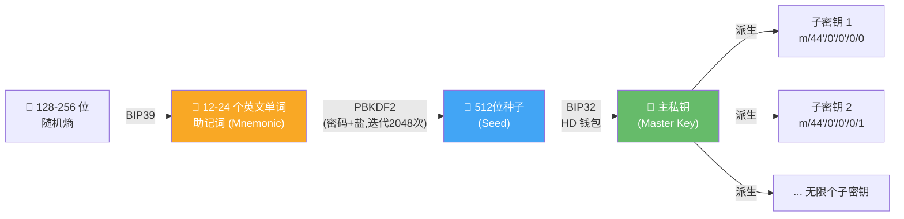

**为什么助记词更安全？**

```
传统备份: 一个私钥文件 → 丢了就全没了
助记词备份: 12 个单词 → 写纸上存保险柜 → 能恢复所有子密钥

BIP32 的魔力: 层级确定性 (Hierarchical Deterministic)
  从 12 个词 → 生成无限个子密钥
  每个子密钥对应一个不同地址
  每次收款用新地址 → 隐私性提升

BIP44 的路径规范:
  m / 44' / 0' / 0' / 0 / 0
    │    │    │    │   │
    │    │    │    │   └── 地址序号 (第几个地址)
    │    │    │    └────── 是否找零地址 (0=收款, 1=找零)
    │    │    └─────────── 账户编号
    │    └──────────────── 币种 (0=Bitcoin, 60=Ethereum)
    └───────────────────── BIP44 标识
```

**真实案例**：2021 年有人找回了一个存有 2 BTC 的旧钱包，因为他只记得 12 个助记词中的 11 个。剩余的 1 个词有 2048 种可能 → 他写脚本遍历 → 几分钟后第 189 个词命中了。如果他丢的是私钥文件本身，那笔钱就永别了。

---

### 10.6 比特币地址的演变——兼容与升级

| 地址类型 | 前缀 | 示例 | 特点 |
|----------|------|------|------|
| **P2PKH** (传统) | `1...` | `1A1zP1eP5QGefi2D...` | 最古老，交易体积最大 |
| **P2SH** (脚本哈希) | `3...` | `3J98t1WpEZ73CNm...` | 支持多签等复杂脚本 |
| **P2WPKH** (原生隔离见证) | `bc1q...` | `bc1qar0srrr7xf...` | SegWit，体积小，手续费低 |
| **P2TR** (Taproot) | `bc1p...` | `bc1p5d7rjq7g6r...` | 2021年新增，隐私+智能合约能力 |

```
为什么兼容性很重要？

  你用 bc1p 地址 → 老旧钱包可能不识别 → 无法给你转账
  你用 1 开头地址 → 全网兼容 → 但手续费更高
  
  交易所的做法:
    同时支持多种地址格式
    优先使用较新的格式 (省手续费)
    但保留对旧格式的完整支持

  Taproot (2021) 带来的进步:
    ✅ 多签交易看起来和普通交易一样（隐私提升）
    ✅ 复杂脚本只在需要时才暴露（更省空间）
    ✅ 支持 Schnorr 签名（比 ECDSA 更高效）
```

> **深入理解**：区块链将"身份认证"问题转化为"资产控制权证明"问题。这是一种范式转换——不再需要权威机构担保"你是你"，而是用密码学证明"你有权花这笔钱"。这种设计消除了对任何第三方的信任依赖，实现了真正的去中心化。

---

## 十一、分叉机制：软分叉与硬分叉

### 11.1 分叉到底是什么？

先抛开"软"和"硬"的概念。分叉本质上就是：**网络中的节点对"哪条链是对的"产生了分歧**。

用生活场景来类比：

```
想象一条高速公路：
  
  [广州] ─── [长沙] ─── [武汉] ─── [郑州] ─── [北京]
  
  所有司机按照同一张地图行驶，一路向北。
  
  某天在郑州，有人发布了两份不同的地图：
  
  地图 A: 继续北上 → 石家庄 → 北京（老路线）
  地图 B: 转向东北 → 济南 → 北京（新路线，声称更快）
  
  版本较旧的导航仪只能识别地图 A → 继续走石家庄
  更新了软件的导航仪能识别地图 B → 转向济南
  
  如果两条路最终都能到北京且互不影响 → 这就是"分叉"
```

---

### 11.2 临时分叉（偶然分叉）——每天都在发生

在理解软/硬分叉之前，必须先说**临时分叉**，因为它才是区块链上最频繁的现象：

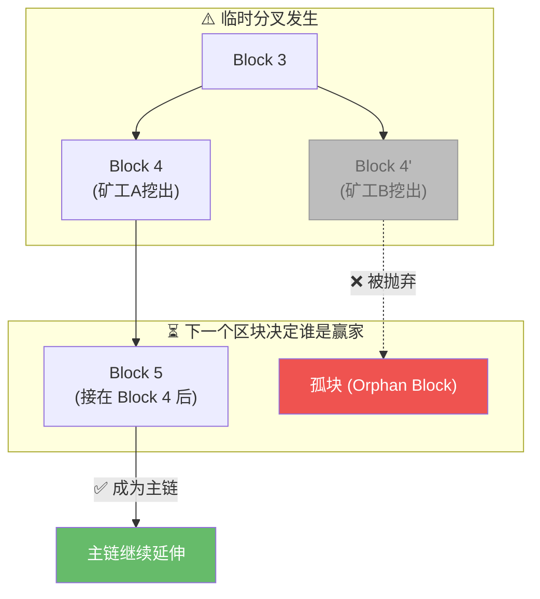

**为什么会发生？**

```
T=00:00  矿工 A 和矿工 B 几乎同时挖到了 Block 4 的解
         → 网络中出现两个"合法的 Block 4"
         → 一部分节点先收到 A 的块，一部分先收到 B 的块
         → 全网暂时分裂成两条链

T=10:00  矿工 C 在 A 的链上挖出了 Block 5
         → A 链现在更长（Block 4 → Block 5 > 单独的 Block 4）
         → 所有节点切换到 A 链
         → B 的 Block 4 变成"孤块"
         → B 矿工白忙了（没有收益）

T=10:01  网络恢复统一
```

**临时分叉的规律**：
- 每天都会发生，是正常现象
- 通常 1-2 个区块后自动解决
- 被丢弃的链上的交易不会丢失——它们回到内存池，等待下一轮打包
- 这就是为什么交易所要求 6 个确认——6 个区块深度后，临时分叉的概率趋近于零

---

### 11.3 软分叉 (Soft Fork)——收紧规则的兼容升级

软分叉的核心逻辑用一句话说：**新规则是老规则的子集。以前允许的，现在不允许了；但以前就禁止的，现在还是禁止。**

**最经典的软分叉案例——SegWit (隔离见证)**

```
问题背景 (2017年之前):
  Bitcoin 区块大小限制 = 1MB
  每笔交易包含签名数据（witness），约占交易体积的 60%
  1MB 塞不下足够多的交易 → 手续费飙升

SegWit 的方案（一个巧妙的花招）:
  ✅ 将"签名数据"从交易中剥离出来，放到一个新区块结构里
  ✅ 这样 1MB 的区块就能装下更多交易
  
  关键: 旧节点看到的是"去掉了签名的精简交易"
       旧节点认为"这笔交易是合法的"（因为旧规则没有规定签名必须在哪里）
       新节点能看到完整交易并正确验证

  这就像把一个包裹拆成两部分:
    旧节点只看到外包装（精简交易） → 认为合法
    新节点能看到完整内容（交易 + 签名） → 正确执行
```

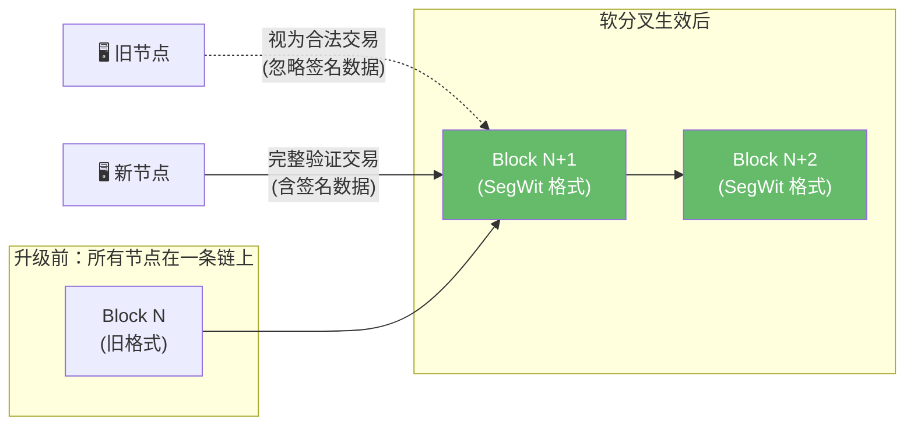

**软分叉的要求**：需要大多数（通常 95%）的算力支持，这样新共识区块能确保占据最长链，旧节点即使不升级也会自动跟随。

**其他软分叉案例**：
| 提案 | 时间 | 内容 |
|------|------|------|
| **BIP 16 (P2SH)** | 2012 | 允许更复杂的脚本条件，旧节点只验证最终哈希 |
| **BIP 65 (OP_CHECKLOCKTIMEVERIFY)** | 2015 | 增加时间锁功能，旧节点将新操作码视为 NOP（无操作） |
| **Taproot** | 2021 | 提升隐私与智能合约能力，同样通过软分叉实现 |

---

### 11.4 硬分叉 (Hard Fork)——放宽规则的不兼容分裂

硬分叉的核心逻辑：**新规则放宽了限制。新区块在旧节点眼里是"非法的"，旧节点会主动拒绝它们。**

最经典的例子——**Bitcoin Cash (BCH) 的诞生**：

```
2017年，Bitcoin 社区爆发了激烈的"扩容战争"：

大区块派 (支持硬分叉):
  "1MB 太小了！交易堵成狗，手续费贵上天！"
  "把区块大小提到 8MB，让更多人能用得起！"
  → 只要让新区块 > 1MB，旧节点就会拒绝 → 这是硬分叉

小区块派 (支持 SegWit 软分叉):
  "硬分叉会分裂社区，太危险了"
  "用 SegWit 扩容就够了，1MB 足够安全"
  → SegWit 是软分叉，不会分裂网络
```

```mermaid
flowchart TB
    COMMON["公共历史<br/>[0]→[1]→...→[478,558]<br/>这是 BTC 和 BCH 共有的祖先"]

    COMMON --> BTC["BTC 链 (1MB SegWit)<br/>[478,559]→[478,560]→..."]
    COMMON --> BCH["BCH 链 (8MB)<br/>[478,559']→[478,560']→..."]

    subgraph "分叉后永久分裂"
        BTC
        BCH
    end

    NOTE1["持有 BTC 的用户<br/>在 BCH 链上自动获得等量 BCH"]
    NOTE2["两条链从此独立运行<br/>互不影响"]

    style BTC fill:#f9a825,color:#fff
    style BCH fill:#4caf50,color:#fff
```

**硬分叉的连锁反应**：

```
BCH 分叉后，又再次分裂：

2017-08  BTC  →  BCH  (Bitcoin Cash, 8MB)
2018-11  BCH  →  BSV  (Bitcoin SV, 128MB, 更大区块派的分裂)
2020-11  BCH  →  XEC  (eCash, 改名+技术路线变更)

每一次硬分叉都意味着:
  ✅ 旧链持有者自动获得新链代币（"免费糖果"）
  ❌ 网络效应被稀释（一条链的算力/用户/开发者被分走）
  ❌ 两条链市值之和通常小于分裂前的单链市值
```

**Ethereum DAO 硬分叉 (2016)——最争议的分叉**：

```
2016年：The DAO 智能合约被黑客利用漏洞盗走 360 万 ETH

分歧:
  回滚派 (Vitalik 等): "这是盗窃，必须回滚拯救受害者"
     → 修改区块链规则，把黑客盗走的 ETH 归还
     → 这是硬分叉，因为旧节点不认可"修改历史"

  不改派 (ETC 支持者): "代码即法律，区块链不可篡改"
     → 即使是被黑也是合法发生的，不应回滚

结果: 硬分叉执行
  → 新链 = ETH (Ethereum) —— 回滚了黑客交易
  → 旧链 = ETC (Ethereum Classic) —— 保留了原始历史
```

---

### 11.5 软分叉 vs 硬分叉——一张对比表看透

| | 软分叉 (Soft Fork) | 硬分叉 (Hard Fork) |
|---|-------------------|-------------------|
| **规则变化方向** | 收紧（"以前允许的，现在禁止"） | 放宽或修改（"以前不允许的，现在允许"） |
| **旧节点视角** | 新区块"看起来合法"（旧规则下没犯错） | 新区块"看起来非法"（违反了旧规则） |
| **是否分裂** | 否，旧节点会自动跟随最长链 | 是，旧节点拒绝新区块后形成独立链 |
| **升级门槛** | 需要 95%+ 算力支持 | 需要全网节点升级，否则网络分裂 |
| **链上资产** | 只有一条链，资产不变 | 分叉时刻持有资产者，在两条链上都有币 |
| **技术难度** | 高（要设计得让旧节点"看不懂但能接受"） | 低（直接改规则，但社会共识难达成） |
| **典型例子** | SegWit, P2SH, Taproot | Bitcoin Cash, Ethereum Classic, BSV |

---

### 11.6 分叉后用户该怎么办？

**软分叉**：什么都不要做，你的钱包自动兼容，资产不变。

**硬分叉**：你在分叉时刻所持有的币，会同时出现在**两条链**上。

```
你在 2017-08-01 持有 1 BTC (区块高度 478,558 处)

分叉后你拥有:
  1 BTC  (在比特币主链上)
  1 BCH  (在 Bitcoin Cash 链上)

它们是独立的两笔资产：
  → 用 BTC 钱包操作 BTC
  → 用 BCH 钱包操作 BCH
  → 互相不能转账（地址格式都不同）

⚠️ 注意重放攻击 (Replay Attack):
  如果没有防重放保护，你在 BTC 链上的一笔转账
  可能被攻击者在 BCH 链上"重放"
  → 导致你 BCH 链上的资产也被转走
  
  现代分叉都会加入防重放机制 (如不同的签名哈希前缀)
```

---

### 11.7 分叉的本质：治理机制还是分裂工具？

```mermaid
flowchart LR
    subgraph "社区共识"
        DEV["👨‍💻 开发者<br/>(提出技术方案)"]
        MINER["⛏️ 矿工<br/>(投票选择链)"]
        USER["👤 用户<br/>(持有资产)"]
        EXCH["🏦 交易所<br/>(流动性/命名权)"]
    end

    DEV -->|"提案"| VOTE{"社区讨论"}
    MINER -->|"算力投票"| VOTE
    USER -->|"经济投票"| VOTE
    EXCH -->|"命名/上架"| VOTE

    VOTE -->|"共识达成"| UPGRADE["软分叉升级"]
    VOTE -->|"无法达成共识"| SPLIT["硬分叉分裂"]

    style UPGRADE fill:#66bb6a,color:#fff
    style SPLIT fill:#ef5350,color:#fff
```

> 分叉不应该被简单归类为"好事"或"坏事"。软分叉代表了社区的进化能力——在不分裂的前提下更新规则。硬分叉则是一种退出机制：当一部分人认为现状已经偏离了初心，他们有权携带资产出走，创建新系统。
>
> 在传统世界里，如果股东对公司方向不满意，只能卖掉股票离场。在区块链世界里，你不满意就可以分叉——资产保留、规则重写。这是一种**用代码实现的民主**，代价是网络效应的稀释。区块链治理的终极问题不是"会不会分叉"，而是"分叉后哪条链能活下来"。

---

## 十二、智能合约简介

### 12.1 概念

智能合约是运行在区块链上的**自动化程序**——"if-then"逻辑的链上实现。

```
传统合约:    双方签字 → 法律背书 → 违约需法院执行
智能合约:    代码定义规则 → 区块链执行 → 自动强制，无需第三方
```

### 12.2 Bitcoin Script vs Ethereum EVM

```mermaid
flowchart LR
    subgraph "Bitcoin Script"
        B1["🚫 非图灵完备"]
        B2["无循环/跳转"]
        B3["有限的状态操作"]
        B4["用途: 多重签名、时间锁、HTLC"]
    end
    subgraph "Ethereum EVM"
        E1["✅ 图灵完备"]
        E2["支持循环/条件/跳转"]
        E3["任意复杂逻辑"]
        E4["用途: DeFi, NFT, DAO, GameFi"]
    end
```

| 特性 | Bitcoin Script | Ethereum Solidity |
|------|---------------|-------------------|
| **图灵完备** | ❌ 故意不完整 (安全设计) | ✅ 完整 |
| **Gas 机制** | ❌ 无，交易费固定 | ✅ 有，按运算量计费 |
| **编程范式** | 栈式操作码 (Forth 风格) | 高级语言 (类 JavaScript) |
| **典型应用** | 多签钱包、闪电网络 | Uniswap, AAVE, OpenSea |
| **安全风险** | 较低 (功能受限) | 较高 (代码漏洞可致巨额损失) |

---

### 12.3 Gas 机制详解——为什么智能合约不是免费的

在 Ethereum 上，每一步操作都要消耗 **Gas**（计算资源费）。这不是为了坑钱，而是为了**防止无限循环耗尽全网资源**。

```
Gas 的三层模型:

  Gas Used (消耗的 Gas 量): 由操作复杂度决定
    - 加法运算: 3 gas
    - 存储写入: 20000 gas
    - 创建合约: 32000 gas+
    
  Gas Price (Gas 单价): 用户自己设定 (单位: gwei, 1 gwei = 10^-9 ETH)
    - 网络空闲: 10 gwei
    - 网络拥堵: 50-500 gwei
    
  Gas Limit (Gas 上限): 用户设定的最大愿意支付的 Gas 量
    - 简单转账: 21000 gas
    - Uniswap 兑换: 150000 gas
    - 复杂合约交互: 500000+ gas

总手续费 = Gas Used × Gas Price

例子:
  你设置 Gas Limit = 200000, Gas Price = 50 gwei
  交易实际消耗 150000 gas
  → 总手续费 = 150000 × 50 gwei = 7,500,000 gwei = 0.0075 ETH
  → 没用完的 50000 gas 会退还给你
```

**为什么要有 Gas Limit？**

```
假设没有 Gas Limit:
  一个恶意合约里包含 while(true) {} 无限循环
  → 矿工执行合约 → 永远执行不完 → 矿机卡死
  → 全网矿工都执行这个合约 → 全网瘫痪

有了 Gas Limit:
  用户: Gas Limit = 1000000
  合约: while(true) {} → 执行到 1000000 gas 用完
  → 矿工: "Gas 用完了，终止执行，状态回滚"
  → 手续费不退（因为矿工确实执行了 1000000 gas 的运算）
  → 攻击者付出巨大成本，但网络不受影响
```

---

### 12.4 史上最著名的智能合约漏洞——The DAO 重入攻击

2016 年，The DAO 合约被黑客利用**重入漏洞**盗走 360 万 ETH，直接导致了 Ethereum 硬分叉。这是理解智能合约安全性的经典案例。

**正常提款流程：**

```
用户调用 withdraw(100 ETH):

1. 检查: 用户余额 >= 100 ETH? ✅
2. 转账: 发送 100 ETH 到用户地址
3. 更新: 用户余额 -= 100
   记录: 用户余额现在是 (原余额 - 100)
```

**重入攻击的原理——漏洞在第 2 步和第 3 步的顺序：**

```mermaid
sequenceDiagram
    participant Hack as 🦹 攻击者合约
    participant DAO as 🏦 The DAO 合约

    Note over Hack: 攻击者存入 100 ETH

    Hack->>DAO: 1. 调用 withdraw(100 ETH)
    DAO->>DAO:    检查: 余额 = 100 ✅
    DAO->>Hack:  2. 发送 100 ETH

    Note over Hack: ⚠️ 收到 ETH 时，自动触发 fallback 函数
    Hack->>DAO:  3. fallback 函数再次调用 withdraw(100 ETH)

    Note over DAO: ⚠️ 注意！此时余额还没更新！
    DAO->>DAO:    检查: 余额仍然 = 100 ✅ (还没减!)
    DAO->>Hack:  4. 再次发送 100 ETH

    Note over Hack: 循环继续...
    Hack->>DAO:  5. fallback → 再取 100 ETH
    DAO->>Hack:  6. 再发送 100 ETH
    Note over Hack: ... 持续直到合约 ETH 被掏空
```

**修复方案（Checks-Effects-Interactions 模式）：**

```
正确顺序:
1. Checks (检查):  验证余额 >= 100 ETH ✅
2. Effects (效果):  更新余额 -= 100 ← 先改状态!
3. Interactions (交互): 最后才发送 ETH

先更新余额再转账 → 即使攻击者递归调用,余额已经是 0 → 攻击失败
```

> **教训**：The DAO 事件不仅是一个漏洞，也暴露了智能合约治理的根本问题——"代码即法律"是否意味着即使代码有 bug，结果也必须被执行？Ethereum 社区选择了回滚（硬分叉），Ethereum Classic 选择了保留。至今没有统一答案。

---

### 12.5 预言机问题——区块链看不到现实世界

智能合约只能访问链上数据。如果它需要外部信息（如 BTC 价格、天气、比赛结果），怎么办？

```
问题:
  智能合约: "如果明天北京下雨，Alice 赢 1 ETH"
  
  但合约怎么知道明天北京下雨了？
  合约无法调用 weather.com 的 API
  
解决方案 —— 预言机 (Oracle):
  Chainlink 等预言机网络充当"区块链的数据搬运工"
  
  1. 多个 Chainlink 节点各自查询天气 API
  2. 各节点提交结果到链上
  3. 合约取中位数/多数结果作为"真相"
  4. 提交错误数据的节点被罚没质押金
  
  本质: 用经济激励确保数据可信
        不是在信任"真实世界"，而是在信任"多数预言机节点是诚实的"
```

```mermaid
flowchart LR
    RW["🌍 现实世界<br/>天气/价格/比赛"] -->|"数据采集"| NODES["🔗 预言机节点<br/>Chainlink"]
    NODES -->|"多数共识"| SC["📜 智能合约"]
    SC -->|"执行结果"| RESULT["💰 自动支付"]

    style NODES fill:#f9a825,color:#fff
    style SC fill:#42a5f5,color:#fff
```

> Bitcoin 的设计哲学是"简单即安全"——故意限制 Script 的功能来降低攻击面。而 Ethereum 选择了"图灵完备"的路线，用 Gas 机制来限制资源消耗。两条路线没有绝对优劣，取决于你更看重"安全性"还是"可编程性"。智能合约的安全性不在于"没有 bug"，而在于"攻击成本 > 攻击收益"——这与 PoW 的安全模型是一脉相承的。

---

## 十三、全景总结

### 13.1 区块链安全金字塔

```mermaid
graph TB
    subgraph "区块链安全模型"
        L4["🔺 应用层安全<br/>智能合约审计、DApp 安全实践"]
        L3["🔺 经济层安全<br/>代币激励、博弈论均衡、手续费市场"]
        L2["🔺 共识层安全<br/>PoW/PoS、最长链规则、51% 攻击成本"]
        L1["🔺 密码学层安全<br/>哈希函数、数字签名、非对称加密"]
    end

    style L1 fill:#1b5e20,color:#fff
    style L2 fill:#2e7d32,color:#fff
    style L3 fill:#388e3c,color:#fff
    style L4 fill:#43a047,color:#fff
```

### 13.2 一图看懂区块链核心概念关系

```mermaid
graph LR
    密码学["🔐 密码学<br/>(哈希 + 签名)"] -->|"提供"| 信任["🤝 去中心化信任"]
    共识["⚖️ 共识机制<br/>(PoW/PoS)"] -->|"达成一致"| 信任
    网络["🌐 P2P 网络<br/>(全节点+矿工)"] -->|"传播与验证"| 信任
    经济["💰 经济激励<br/>(区块奖励+手续费)"] -->|"驱动参与"| 共识
    信任 -->|"支撑"| 应用["🚀 应用层<br/>转账/DeFi/NFT/DAO"]

    style 信任 fill:#f9a825,stroke:#333,color:#fff
    style 应用 fill:#7b1fa2,stroke:#333,color:#fff
```

### 13.3 核心要点速查

| # | 核心原理 | 一句话总结 |
|---|----------|-----------|
| 1 | **链式结构** | 哈希指针串联区块，篡改一处则全链断裂 |
| 2 | **Merkle 树** | 二叉树哈希汇总，O(log n) 完成交易验证 |
| 3 | **PoW 共识** | 算力竞猜 Nonce，最长链即真理 |
| 4 | **难度调整** | 每 2016 块自动调参，出块恒 10 分钟 |
| 5 | **UTXO 模型** | 硬币模式，花即销毁，天然防双花 |
| 6 | **非对称加密** | 私钥签名、公钥验证，无 CA 信任 |
| 7 | **节点容错** | 拜占庭容错，单点故障不影响全网 |
| 8 | **减半经济** | 4 年减半，2140 年发行完毕，转手续费驱动 |
| 9 | **分叉治理** | 软分叉兼容升级，硬分叉社区分裂 |
| 10 | **智能合约** | 链上自动程序，代码即法律 |

---

*本文以 Bitcoin 为主线，兼顾 Ethereum 等主流公链的核心差异，力求构建一个系统化的区块链认知框架。技术细节不断演进，但底层原理长期有效。*
